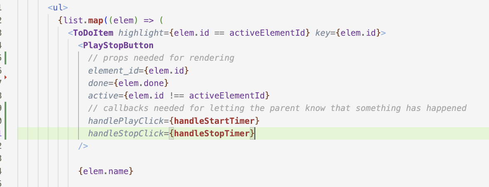

# Patterns of Component Communication
## parent to child = via props

- parent can send information to the child via props

## child to parent = via callbacks
- child does not even know who the parent is (imagine a button, it does not know, and it should not know who uses it)
- but the parent will give it callbacks and it can call them, effectively communicating to the parent

**Next**: once you extract components, two of them end up needing the same state, and
neither owns it. That is *lifting state up*, and it is in
[Refactoring by Extracting Components](Refactoring-by-Extracting-Components.md) —
because extraction is what creates the problem in the first place.

## Exam Questions

### 1. Explain the three patterns of component communication in React.
