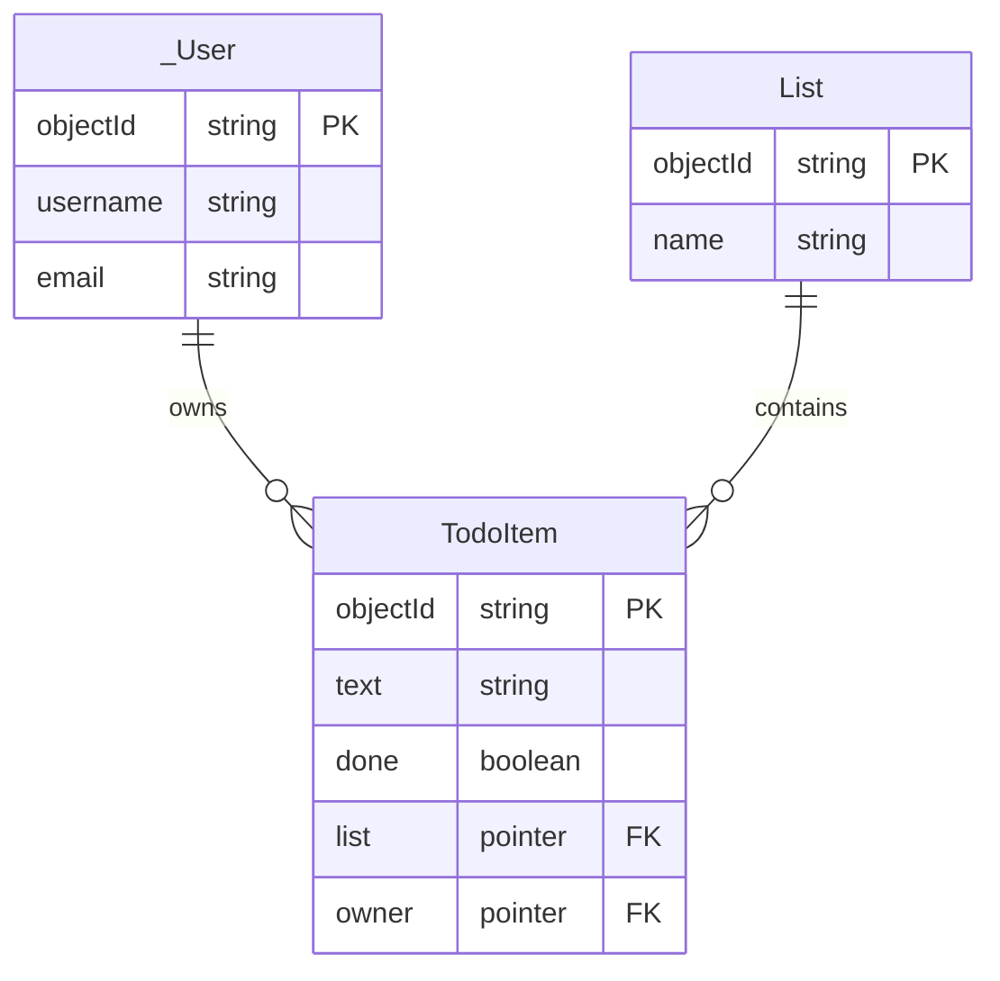

# Authentication and Authorization (in Parse)

Two words that sound alike and mean different things, which is why they belong in the same lecture:

- **Authentication** — proving that a user is who they say they are. *Who are you?*
- **Authorization** — deciding what that user is then allowed to do. *What are you allowed to touch?*

The first half of today gives your app accounts. The second half stops those accounts from reading each other's data. Neither half is worth much without the other: accounts that everyone can read through are theatre, and permissions with nobody to attach them to are unusable.

# Part 1: Authentication

## Parse gives you accounts, login and the current user without your writing any of it

The Javascript Parse SDK helps you manage user accounts and track the logged in user. `_User` is a class that already exists in your database, with `username`, `password` and `email` already on it, and with the password already being hashed for you.

### Signing up and logging in

```jsx
import { useState } from 'react';
import Parse from 'parse';

export default function AuthPage({ onAuthenticated }) {
	const [username, setUsername] = useState('');
	const [password, setPassword] = useState('');
	const [error, setError] = useState('');

	async function handleSignUp(e) {
		e.preventDefault();
		setError('');
		try {
			const user = new Parse.User();
			user.set('username', username);
			user.set('password', password);
			await user.signUp();
			onAuthenticated(user);
		} catch (err) {
			setError(err.message);
		}
	}

	async function handleLogin(e) {
		e.preventDefault();
		setError('');
		try {
			const user = await Parse.User.logIn(username, password);
			onAuthenticated(user);
		} catch (err) {
			setError(err.message);
		}
	}

	return (
		<div>
			<h1>Welcome</h1>
			{error && <p style={{ color: 'red' }}>{error}</p>}

			<form>
				<input
					type="text"
					placeholder="Username"
					value={username}
					onChange={(e) => setUsername(e.target.value)}
				/>
				<input
					type="password"
					placeholder="Password"
					value={password}
					onChange={(e) => setPassword(e.target.value)}
				/>
				<button onClick={handleSignUp}>Sign Up</button>
				<button onClick={handleLogin}>Log In</button>
			</form>
		</div>
	);
}
```

What happens:
- `user.signUp()` creates a new user, and logs them in
- `Parse.User.logIn()` logs in an existing one
- Both of them manage the session for you
- Log out with `await Parse.User.logOut()`

### Showing the login page, without a router

Both handlers finish by calling `onAuthenticated`. They do *not* navigate anywhere, because we have no router yet — that is week 6. We do not need one:

```jsx
function App() {
	const [user, setUser] = useState(Parse.User.current());

	if (!user) {
		return <AuthPage onAuthenticated={setUser} />;
	}

	return <ToDoList user={user} onLogOut={() => Parse.User.logOut().then(() => setUser(null))} />;
}
```

This is [conditional rendering](../React/Conditional-Rendering.md) again, in its whole-screen form: either the app, or the way in. A router will later give each of these its own URL, which is a real improvement — but notice that what a router adds here is *addressability*, not the gating. The gating is this `if`.

### Getting the current user

It would be silly if the user had to login every time they opened the app, so Parse stores the logged-in user in `localStorage` and hands them back to you:

```jsx
const currentUser = Parse.User.current();
if (currentUser) {
	// do stuff with the user
} else {
	// show the signup or login page
}
```

This is why `useState(Parse.User.current())` above is safe as a `useState` initializer while `fetchTodos()` was not: `current()` reads from `localStorage` and is synchronous. No network, no waiting, no third state.

### Logging out

```jsx
await Parse.User.logOut();
// Parse.User.current() is now null
```

### Associating the to-dos with their owner

A to-do now belongs to somebody. That is one more pointer, exactly like the `list` pointer from last week:

```js
item.set("owner", Parse.User.current());
```

and then the query that fetches them says so:

```js
const query = new Parse.Query(TodoItem);
query.equalTo("owner", Parse.User.current());
const results = await query.find();
```

**Why is this critical?**
- It allows the query "show me only *my* todos"
- It is what data privacy will be built on
- It is what the access control in Part 2 attaches to

**But it is not yet security.** That `equalTo` is a convenience for the client, not a rule on the server. A user who opens the developer tools, or who talks to the REST API directly, can simply not send that constraint — and today your server would happily answer. Which is what the rest of the lecture is about.

More advanced features, for later
- [Email Verification](https://docs.parseplatform.org/js/guide/#verifying-emails)
- [Security of User Objects](https://docs.parseplatform.org/js/guide/#security-for-other-objects) - only a user can modify their own data
- [Resetting Passwords](https://docs.parseplatform.org/js/guide/#resetting-passwords)

# Part 2: Authorization


### Motivation

##### **Why can you not keep the Parse API keys perfectly secret?** 
- Remember the architectural diagram from the beginning of the course? bundle.js is sent to the browser...
- The JavaScript code of your web application can be inspected by another web programmer.

##### **What happens if I access your repository and find your AppID and JSKey?**
- Read info that is not meant for me
- Delete useful information
- Store my movie collection in your tables
- etc.

That is - **only if you have made your tables public**
- When we created the DB we were asked about access control and we agreed to make everything public because we're working on an MVP.
- Now it's time to harden the security of our database


### **What can we do if the API keys can't be made secret?** 

Use access control in such a way that even with the keys, no harm can be done

1. Limit access to tables
2. Limit access to individual objects
3. Restrict class creation

Let us take each of these in turn.

#### 1. Limiting Access to Tables

##### For every table you can choose who has access to it and what privileges they have

###### Who has access can be specified with multiple levels of granularity
  - Public (anyone, even unauthenticated)
  - Authenticated users (requiresAuthentication)
  - Specific users
  - Roles

###### Privileges for the entire class
 - Get - retrieve individual objects by ID
 - Find - query for objects
 - Create - create new objects
 - Update - modify existing objects
 - Delete - delete objects
 - Add Fields - add new fields to the schema


The image below shows the Parse UI for setting Class-level permissions


###### Practical Implication: For your applications, you can prevent non-authenticated users to access your tables


#### 2. Object-Level Permissions

Even if now you only allow logged in users, it would still not be desirable that an unfriendly user creates an account and then
- reads other users data
- or even starts deleting other people's data!

This is where the **Access Control Lists** concept come into play. They allow you to set **fine-grained permissions** for every row in your table. Usually they are **created at the same time** as the object.

##### Who can ACL permissions apply to? 
  - Public
  - Specific users
  - Roles

  #### Privileges per object
  - Read - can retrieve/query this object
  - Write - can update or delete this object

##### Examples
###### User creates a private note

In the following example, a logged in user, creates a private note and ensures that it is only himself that can access that note:

```js
const Counter = Parse.Object.extend("Counter");
const privateCounter = new Counter();
privateCounter.set("name", "Times Checked Twitter");
privateCounter.set("count", 42);
privateCounter.setACL(
	new Parse.ACL(Parse.User.current()));
privateCounter.save();
```

###### Read for public but write only for owner
It is sometimes desirable that an object can be **read by other users**, but just **can not be written by them**. For such a case the `Parse.ACL` object offers the `setPublicReadAccess(true)` method call:
```js
const Post = Parse.Object.extend("Post");
const publicPost = new Post();
publicPost.set("content", "I love technical interaction design");
publicPost.setACL(new Parse.ACL(Parse.User.current()));
publicPost.setPublicReadAccess(true);
publicPost.save();
```
Access control lists can be modified every time an object is saved.

#### 3. Restricting Class Creation

Surely, not all users should be allowed to create classes either!

Under `App Settings > Server Settings > Client Class Creation` you can specify if your expect users to be allowed to create new classes in your database. Probably you do not want that.


#### 4. Combining Authorization Methods to Harden the Security of an Application

The methods above should be combined together to strengthen the DB access for  your application.


In practice, there's no real reason to have any public tables. If it's a public list of objects, they can be hardcoded in the application.

### Case Study: ToDo26

#### The model we are hardening



Two pointers. Parse adds `objectId`, `createdAt` and `updatedAt` to every class for free, so the only fields we declare are the ones that mean something. The `owner` pointer is the one that arrived today, and everything that follows hangs off it.

#### The query that looks like security, and is not

`fetchTodos` from last week lives in `src/services/todoService.js`. Now that a to-do has an owner, it grows one more constraint:

```js
export async function fetchTodosByList(list) {
  const query = new Parse.Query(TodoItem);
  query.equalTo("list", list);
  query.equalTo("owner", Parse.User.current());
  query.ascending("createdAt");   // oldest first

  const results = await query.find();
  return results.map(toPlainObject);
}
```

- Note the multiple query conditions
- Note the ordering constraint

**But there's a problem**: the query filter is a convenience for *our* client. It is not a rule on the server, and nothing obliges anyone to send it.

And they do not need to tamper with your client to leave it out. They do not need your client at all: `npm install parse`, twenty lines of Node, and the App ID and JavaScript key they read out of the bundle you shipped them. Then they run whatever query they like, against the same server, with the same keys — and today it answers.

#### Access Controls when creating a new Todo item

```js
export const createTodoItem = async (text, list) => {

	const currentUser = Parse.User.current();

	const item = new TodoItem();
	item.set("text", text);
	item.set("list", list);
	item.set("done", false);
	item.set("owner", currentUser); // ← Links to user!
	
	
	// Set ACL so only creator can read and write
	const acl = new Parse.ACL();
	acl.setReadAccess(currentUser, true);
	acl.setWriteAccess(currentUser, true);
	item.setACL(acl);
	
	
	try {
		const result = await item.save();
		
		// the same plain-object conversion as everywhere else
		return toPlainObject(result);
	} catch (error) {
		console.error("Error creating todo:", error);
		throw error;
	}

};

```
###### Observation: A more concise way 
```js
	const acl = new Parse.ACL();
	acl.setReadAccess(currentUser, true);
	acl.setWriteAccess(currentUser, true);
	item.setACL(acl);
	
	// is equivalent to
	
	const acl = new Parse.ACL(currentUser);
	item.setACL(acl);
```

##### Other object-level configurations

###### Sharing with another user

```js
  const acl = new Parse.ACL(currentUser); // owner has full access
  acl.setReadAccess(otherUser, true);   // other user can read
  acl.setWriteAccess(otherUser, true);  // other user can write
```
###### Public read - owner write
```js
  const acl = new Parse.ACL(currentUser); // owner has full access
  acl.setPublicReadAccess(true);  // anyone can read
```
###### Role-Based Access
```js
  const acl = new Parse.ACL(currentUser);
  acl.setRoleReadAccess("TeamMembers", true);
  acl.setRoleWriteAccess("TeamMembers", true); 
```
###### Two types of roles
###### **Application-level roles** (Moderators, Admins, Premium Users)
- Created manually in Parse Dashboard or via Cloud Code
- Managed by the app administrators, not end users
- Public read of the role is normal - users should see who the moderators are

###### **User-created roles** (e.g. Family, MyTeam, ProjectX)
- Created programmatically by regular users from the app
- Each user manages their own teams
- Private - no reason for others to see them

```js
  // Say user creates a "TeamMembers" role
  
  const roleACL = new Parse.ACL(currentUser);
  
  const role = new Parse.Role("TeamMembers", roleACL);

  // Later our user can add other users to this role
  role.getUsers().add(user1);

  await role.save();
```
#### ACL does not work at the field level

  In Parse, **ACLs work at the object level, not at the field/column level**. This means you cannot make some fields public and other fields private within the same object.
  
  **Example scenario**
  - You want everyone to **see your todo task name** and done status (public read)
  - But you want to **keep your time tracking data private** (only you can read)

##### Problem: You can not set some fields private and some public 
```js
  // This does NOT work - you can't set different permissions per field
  const todo = new TodoItem();
  todo.set("text", "Write report");           // want this PUBLIC
  todo.set("done", false);                    // want this PUBLIC  
  todo.set("totalTime", 3600000);            // want this PRIVATE
  todo.set("currentSessionStart", new Date()); // want this PRIVATE

  const acl = new Parse.ACL(currentUser);
  acl.setPublicReadAccess(true); // This makes ALL fields public!
  todo.setACL(acl);

```
##### Solution: Split data into two tables with a 1-to-1 relationships

###### Table 1: TodoItem (Public)
```js
  const TodoItem = Parse.Object.extend("TodoItem");
  const todo = new TodoItem();
  todo.set("text", "Write report");
  todo.set("done", false);
  todo.set("owner", currentUser);

  // Public read, owner write
  const acl = new Parse.ACL(currentUser);
  acl.setPublicReadAccess(true);
  todo.setACL(acl);
  await todo.save();
  ```
######  Table 2: TodoTimeTracking (Private)
```js
  const TodoTimeTracking = Parse.Object.extend("TodoTimeTracking");
  
  const timeTracking = new TodoTimeTracking();
  
  timeTracking.set("todoId", todo);  // Pointer to the TodoItem
  timeTracking.set("totalTime", 3600000);
  timeTracking.set("currentSessionStart", new Date());
  timeTracking.set("owner", currentUser);

  // Private - only owner can read and write
  const acl = new Parse.ACL(currentUser);
  timeTracking.setACL(acl);
  await timeTracking.save();
```


#### Folder Structure

##### Separate Pages and Reusable Components 

My favorite way of organizing
- **pages**  -- One file per page/view
- **components** -- Reusable UI components
- **services** -- API/backend logic
- **utilities** -- a catch all for things that we don't know where to put yet

```bash
  src/
  ├── assets/       
  ├── pages/              
  │   ├── LoginPage.jsx
  │   └── HomePage.jsx
  ├── components/         
  │   ├── TodoList/    
  │   │   ├── TodoList.jsx
  │   │   ├── TodoItem.jsx
  ├── services/           
  │   ├── authService.js
  │   └── todoService.js
  ├── constants/
  ├── utilities/
  └── App.jsx

```

Also, refactor, refactor, refactor. When you find a better organization, go with that.


## Reading
From the ParsePlatform.org Guide:
- [Class-level Permissions](https://docs.parseplatform.org/js/guide/#class-level-permissions)
- [Object-level Access Control](https://docs.parseplatform.org/js/guide/#object-level-access-control)


### Exam Questions

#### 1. Why can't Parse API keys be kept secret in a web application?

#### 2. What is the difference between authentication and authorization?

#### 3. What are the three methods of access control in Parse?

#### 4. What is an ACL and at what level does it operate?

#### 5. Explain what this code does:
```js
const privateNote = new Note();
privateNote.set("content", "My secret");
privateNote.setACL(new Parse.ACL(Parse.User.current()));
await privateNote.save();
```

#### 6. How would you make an object publicly readable but only writable by the owner?

#### 7. What's the problem with this code if we only validate the length on the client?
```js
// Client-side validation
if (text.length > 200) {
  alert("Too long!");
  return;
}
await todoItem.save();
```

#### 8. This query returns only the current user's to-dos. Explain why it is nevertheless not a security measure, and what is.
```js
const query = new Parse.Query(TodoItem);
query.equalTo("owner", Parse.User.current());
const results = await query.find();
```

#### 9. What are the two types of roles in Parse and how do they differ?

#### 10. Why can't ACLs be set at the field level, and what's the workaround?
