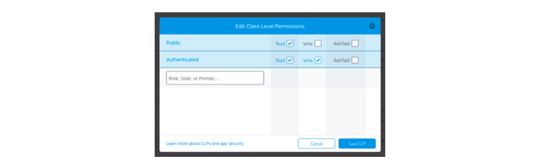
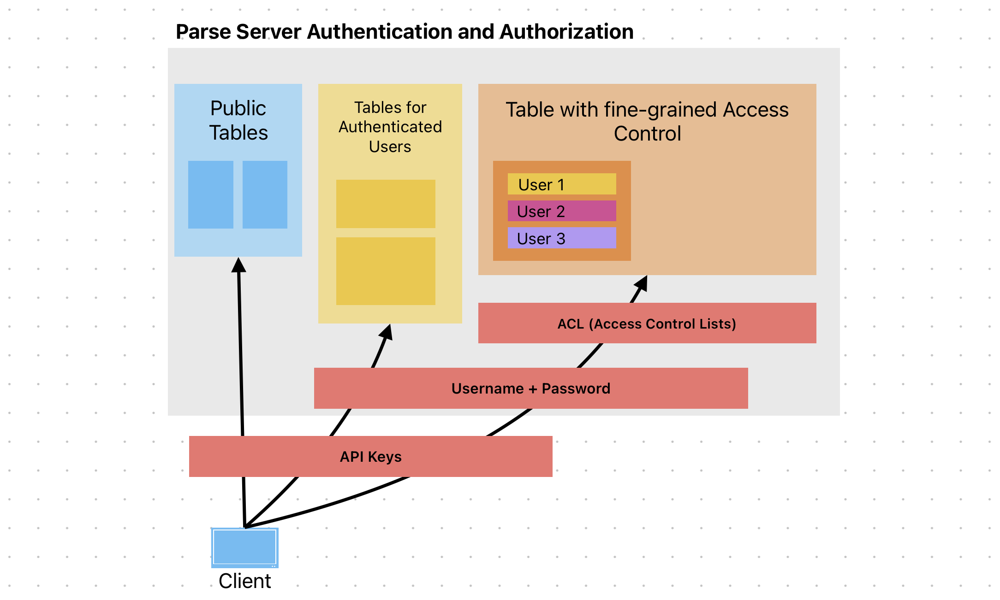

# Authentication and Authorization (in Parse)

Two words that sound alike and mean different things, which is why they belong in the same lecture:

- **Authentication** — proving that a user is who they say they are. *Who are you?*
- **Authorization** — deciding what that user is then allowed to do. *What are you allowed to touch?*

Here is where we are going. Ada and Armin both use your to-do app. By the end of this note, each of them logs in, and Armin cannot see Ada's to-dos, not even by skipping your app and talking to the server directly. The first half gives your app accounts (authentication); the second half stops those accounts from reading each other's data (authorization).

# Part 1: Authentication

## Parse gives you accounts, login and the current user without your writing any of it

### On the backend, there's a separate class for user accounts

`_User` is a class that already exists in your database, with `username`, `password` and `email` already on it, and with the password already being hashed for you (stored scrambled, so that not even you can read it back).


### On the front-end, `signUp` creates an account and `logIn` checks a password

The Javascript Parse SDK helps you manage user accounts and track the logged in user. 

### Signing up and logging in

```jsx
import { useState } from 'react';
import Parse from 'parse';

export default function AuthPage({ onAuthenticated }) {
	const [username, setUsername] = useState('');
	const [password, setPassword] = useState('');
	const [error, setError] = useState('');

	async function handleSignUp(e) {
		e.preventDefault();
		setError('');
		try {
			const user = new Parse.User();
			user.set('username', username);
			user.set('password', password);
			await user.signUp();
			onAuthenticated(user);
		} catch (err) {
			setError(err.message);
		}
	}

	async function handleLogin(e) {
		e.preventDefault();
		setError('');
		try {
			const user = await Parse.User.logIn(username, password);
			onAuthenticated(user);
		} catch (err) {
			setError(err.message);
		}
	}

	return (
		<div>
			<h1>Welcome</h1>
			{error && <p style={{ color: 'red' }}>{error}</p>}

			<form>
				<input
					type="text"
					placeholder="Username"
					value={username}
					onChange={(e) => setUsername(e.target.value)}
				/>
				<input
					type="password"
					placeholder="Password"
					value={password}
					onChange={(e) => setPassword(e.target.value)}
				/>
				<button onClick={handleSignUp}>Sign Up</button>
				<button onClick={handleLogin}>Log In</button>
			</form>
		</div>
	);
}
```

What happens:
- `user.signUp()` creates a new user, and logs them in
- `Parse.User.logIn()` logs in an existing one
- Both of them manage the session for you

### Information about whether the user is authenticated has to be kept as state the App level not in the authentication component

Thus
- we declare a state
- we initialize it with `Parse.User.current()` 
- we pass a callback to `AuthPage` (`handleAuthenticated`) that it will call in case it has a logged in user 
- then we can use  [conditional rendering](../React/Conditional-Rendering.md) **with an early return** again to either render the Auth page or the actual application 

```jsx
function App() {

	const [user, setUser] = useState(Parse.User.current());

    function handleAuthenticated(loggedInUser) {  
         setUser(loggedInUser);  
    }

	// conditional early return
	if (!user) {
		return <AuthPage onAuthenticated={handleAuthenticated} />;
	}

	return <ToDoList />;
}
```


### Logging out

- the Parse API is offering us `Parse.User.logOut()`
- we add a button
- and attach the handler

Both go in `App`, because that is where `setUser` lives:

```jsx
function handleLogout() {
	Parse.User.logOut().then(() => setUser(null));
}

// ... after the early return

return (
	<>
		<ToDoList />
		<button onClick={handleLogout}>Logout</button>
	</>
);
```


### The current user information is stored in the localStorage

It would be silly if the user had to login every time they opened the app, so Parse stores the logged-in user in `localStorage` and hands them back to you:

```jsx
const currentUser = Parse.User.current();
if (currentUser) {
	// do stuff with the user
} else {
	// show the signup or login page
}
```

This is why `useState(Parse.User.current())` above is safe as a `useState` initializer while `fetchTodos()` was not: `current()` reads from `localStorage` and is synchronous. No network, no waiting, no third state.

### How the server knows it is you


#### After you log in, a session token in your localStorage identifies you: the same sessionToken you can find in the backend database

Open the developer tools right after logging in, and look in **Application → Local Storage**. Parse has stored the current user there, and inside it a `sessionToken`: a long random string that the server handed out when your password checked out.


#### The sessionToken is the thing that compensates for the fact that HTTP is stateless 
The reason it exists: **HTTP is stateless.** The server forgets you the moment it has answered a request. So from now on every call your app makes carries that token, and the token is what proves who is calling. Your password was sent once, at login; the token is sent every time instead.

You can watch it travel. Open the **Network** tab, tick a checkbox, and click the request that appears. It is the same request as [last week](Backends-Low-Code-Backends-and-the-Parse-Platform.md), with one line more:

```
POST https://parseapi.back4app.com/parse/classes/TodoItem/AbC123xY

{"done":true, "_method":"PUT",
 "_ApplicationId":"YOUR_APP_ID",
 "_JavaScriptKey":"YOUR_JS_KEY",
 "_SessionToken":"r:aBcD1234..."}
```

The app id and the JavaScript key say **which application** is calling, and every visitor has them. `_SessionToken` appeared when you logged in, and says **who** is calling. It is the only thing in this request that lets the server tell you apart from anybody else.

Two things worth being precise about:

1. The token is **not encrypted**. 
	- It is random, and long, so it can't be guessed 
	- Is meaningless to anyone who does not have the database. 
	- What protects it on its way to the server is **HTTPS**, which encrypts the whole connection.

2. Whoever has the token, *is you*, from the server's point of view 
	- Copy token out of this browser into another one, and the server cannot tell the difference. 
	- This is called **session hijacking**, and it is why `logOut()` does not merely delete the token from your browser: it destroys the session **on the server too**. 

# Part 2: Authorization

## The API keys are public, so the protection has to be attached to the user

[Last week](Backends-Low-Code-Backends-and-the-Parse-Platform.md) we saw the app id and the JavaScript key written in plain text in every request your app sends. Anybody who opens your app can read them, and no setting changes that. What the server *can* tell apart is the user, through the session token from Part 1. Everything in this half hangs off that.

### With your keys, anyone can do whatever your public tables allow

- Read information that is not meant for them
- Delete your data
- Store their movie collection in your tables

When we created the database we agreed to make everything public, because we were building an MVP. Now it is time to harden it.

### Parse gives you three layers of access control

Use access control in such a way that even with the keys, no harm can be done. We take the layers from the most concrete to the coarsest:

1. **Object level** — who can read and write *this row* (ACLs)
2. **Class level** — who can touch *this table* at all (class-level permissions)
3. **Schema level** — who can create *new tables* (client class creation)

## 1. Object-Level Permissions: Access Control Lists

### See the problem first

Open the app in two windows side by side: a normal one and an incognito one. Their local storage is separate, so you can be logged in as two different users at once. Log in as Ada on the left, as Armin on the right.

Ada creates a to-do. Refresh Armin's window: **Armin can see it!** Every user sees every to-do, because nothing in the database says whose it is or who may read it.

### The fix: an ACL on every object

An **Access Control List** is attached to one object, and says who may do what to it. They allow you to set **fine-grained permissions** for every row in your table. Usually they are **created at the same time** as the object.

```js
export const createTodo = async (text) => {
	const currentUser = Parse.User.current();

	const item = new TodoItem();
	item.set("text", text);
	item.set("done", false);

    // only the creator can read and write
	item.setACL(new Parse.ACL(currentUser)); 

	const result = await item.save();
	return toPlainObject(result);
};
```

Ada creates another to-do, Armin refreshes, and this one does not appear.

**But the old one still does.** An ACL is set on an object when it is saved; it does not reach back to objects saved before your code changed. The to-dos created without an ACL are still readable and writable by everybody, and will stay so until you give them one. For test data, the quickest fix is to delete those rows in the dashboard's database browser.

You will meet this in your own project, as old test data that behaves differently from new data.

##### Who can ACL permissions apply to?
  - Public
  - Specific users
  - Roles (named groups of users; see the end of this note)

##### Privileges per object
  - Read - can retrieve/query this object
  - Write - can update or delete this object

### `new Parse.ACL(user)` is shorthand for read / write for the given user  
```js
const acl = new Parse.ACL();
acl.setReadAccess(currentUser, true);
acl.setWriteAccess(currentUser, true);
item.setACL(acl);
```

is equivalent to

```js
item.setACL(new Parse.ACL(currentUser));
```

### Public read, owner write: Ada's to-dos are visible to everyone, but only Ada can change them

Sometimes an object should be **read by other users** but **not written by them**. Ada is packing for a trip, and wants the people she travels with to see her to-dos, but she does not want anybody else ticking them off. `setPublicReadAccess(true)` opens reading, and leaves writing to whoever the ACL already names. This is a variant of `createTodo` above, for this example only:

```js
export const createTodo = async (text) => {
	const currentUser = Parse.User.current();

	const item = new TodoItem();
	item.set("text", text);
	item.set("done", false);

	const acl = new Parse.ACL(currentUser); // Ada can read and write
	acl.setPublicReadAccess(true);          // everybody can read
	item.setACL(acl);

	const result = await item.save();
	return toPlainObject(result);
};
```

Armin refreshes, and Ada's to-do appears in his list. He ticks its checkbox. What happens?

- **The app does not crash.** `save()` rejects, the line that updates the state never runs, and the checkbox stays unticked. It is the same thing you saw with the network turned off [last week](Backends-Low-Code-Backends-and-the-Parse-Platform.md): nothing changes on screen, which is the truth.
- **The error is not "permission denied".** It is error 101, **"Object not found"**. The server does not even admit that a row Armin may not write to exists. Look for it in the console, where it shows up as an uncaught promise rejection, because our `handleToggle` does not catch anything.
- **The server is protected, but the interface is not honest.** Armin was offered a checkbox that could never work. The ACL comes back with every object, so the client can ask it before drawing the checkbox. `toPlainObject` could add a `canWrite` field, computed from `item.getACL().getWriteAccess(Parse.User.current())`. For Armin it would be `false`, and the checkbox could be disabled, or not drawn at all. (An object with no ACL returns `null` from `getACL()`, and means everyone may write.)

An ACL can be changed every time the object is saved, so Ada can open her to-dos up, or close them again, later.

### Sharing with another user

```js
const acl = new Parse.ACL(currentUser); // owner has full access
acl.setReadAccess(otherUser, true);     // other user can read
acl.setWriteAccess(otherUser, true);    // other user can write
```

`otherUser` is a `Parse.User`, and if all you have is their id, `Parse.User.createWithoutData(id)` makes one. How your app learns that id in the first place (an invitation, a share link, a user who accepts a shared list) is a design question for your own app. It gets harder, not easier, once you lock down the `_User` class below.

## 2. Class-Level Permissions


### Our login page protects nothing: anyone can skip the app and talk to the server directly

Our app now shows nothing but the login page to a visitor who is not logged in. That conditional render feels like a lock, but it only locks our own interface. The server is one HTTP request away, and the keys that request needs are the ones we ship to every visitor. So skip the app entirely, and create a to-do from the terminal, without ever logging in:

```bash
curl -X POST "$PARSE_SERVER_URL/classes/TodoItem" \
  -H "X-Parse-Application-Id: $APP_ID" \
  -H "X-Parse-Javascript-Key: $JS_KEY" \
  -H "Content-Type: application/json" \
  -d '{"text":"I never logged in","done":false}'
```

`curl` sends an HTTP request from the terminal. Replace `$PARSE_SERVER_URL`, `$APP_ID` and `$JS_KEY` with the three values from your `.env.local`.

It works. The server answers with the `objectId` of a new row, and because nobody attached an ACL to it, the row is public: it shows up in the list of every user of your app. (The same request can be written with `fetch` just as easily; [Web Service APIs](Web-Service-APIs.md) does that properly later in the course.)

ACLs cannot stop this, because an ACL belongs to a row that already exists. Stopping the *creation* is a job for the next layer: class-level permissions sit in front of the ACLs and decide whether a user may touch the class *at all*.

For every class you choose who has access and with which privileges.

###### Who has access can be specified with multiple levels of granularity
  - Public (anyone, even unauthenticated)
  - Authenticated users (the **Authenticated** row in the dashboard)
  - Specific users
  - Roles

###### Privileges for the entire class
 - Get - retrieve individual objects by ID
 - Find - query for objects
 - Create - create new objects
 - Update - modify existing objects
 - Delete - delete objects
 - Add Fields - add new fields to the schema

The image below shows the Parse UI for setting Class-level permissions


### Try it: only logged-in users may create to-dos

Somebody without an account has no business creating to-dos. In the dashboard:

1. Open the database browser and select the `TodoItem` class.
2. Open its **Security** settings. The *Edit Class Level Permissions* dialog above appears.
3. In the **Public** row, untick **Write**. In the **Authenticated** row, keep **Read** and **Write** ticked.
4. Click **Save CLP**.

Then run the same `curl` again: this time the server refuses. The app still works for Ada and Armin, because they are logged in.

The simple dialog groups privileges: **Write** covers Create, Update and Delete. The gear icon in its top right corner switches to the detailed view, with one checkbox per privilege.

One toggle, and one layer of the lecture becomes visible. Class level says who may knock; the ACL says which rows open.

### The exception: `_User`

Every other class tightens. One class cannot: **`_User` must keep Create public**, because signing up *is* creating a user, and the person signing up is by definition not logged in yet.

What must not stay public on `_User` is everything else. By default a user can only modify their own user object, but user objects can be read by anyone — so with the keys from your bundle, a stranger could list every account in your app. In the `_User` class-level permissions, switch to the detailed view with the gear icon, and untick **Find** in the **Public** row. Create stays open.

<!-- TODO before Thursday: check on Back4App exactly which _User CLP columns can be turned off without breaking login and Parse.User.current(). -->

## 3. Restricting Class Creation

Surely, not all users should be allowed to create classes either!

Under `App Settings > Server Settings > Client Class Creation` you can specify if you expect users to be allowed to create new classes in your database. Very handy in week one, when saving to a class that does not exist yet simply creates it. Very dangerous in production, where anyone with your keys can do the same. Turn it off.

## Combining the three

The methods above should be combined together to strengthen the DB access for your application.



Most classes should not be public. When some data really should be readable by everyone, like Ada's to-dos above, make that a decision per object, with an ACL, rather than a default for the whole class. And data that never changes, like a list of countries, may not need a class at all: it can live in the app's code.

## Field-level permissions

An ACL covers a whole object, so it cannot make one field public and another private. When you need that — a to-do whose text is shared but whose time-tracking is not — the data has to be split across two classes. That is week 12's subject: [Field-Level Permissions, and the Two-Table Workaround](Field-Level-Permissions.md).

## Advanced: roles, for groups of users you reuse

If your design has **named groups of users that are reused** across many objects — a family, a team, the moderators — look up **roles**: a role is an object that holds users, and you can put a role into an ACL instead of listing the users one by one. For one-off sharing with a person or two, putting them in the ACL directly is simpler.

<details>
<summary>More on roles, for when your project needs them</summary>

###### Role-Based Access
```js
  const acl = new Parse.ACL(currentUser);
  acl.setRoleReadAccess("TeamMembers", true);
  acl.setRoleWriteAccess("TeamMembers", true); 
```
###### Two types of roles
###### **Application-level roles** (Moderators, Admins, Premium Users)
- Created manually in Parse Dashboard or via Cloud Code
- Managed by the app administrators, not end users
- Public read of the role is normal - users should see who the moderators are

###### **User-created roles** (e.g. Family, MyTeam, ProjectX)
- Created programmatically by regular users from the app
- Each user manages their own teams
- Private - no reason for others to see them

```js
  // Say user creates a "TeamMembers" role.
  // Role names are unique across the whole app, so a real app would add an id to the name.
  
  const roleACL = new Parse.ACL(currentUser);
  
  const role = new Parse.Role("TeamMembers", roleACL);

  // Later our user can add other users to this role
  // (user1 is a Parse.User, e.g. from Parse.User.createWithoutData(id))
  role.getUsers().add(user1);

  await role.save();
```

</details>

## Reading
From the ParsePlatform.org Guide:
- [Class-level Permissions](https://docs.parseplatform.org/js/guide/#class-level-permissions)
- [Object-level Access Control](https://docs.parseplatform.org/js/guide/#object-level-access-control)


### Exam Questions

#### 1. Why can't Parse API keys be kept secret in a web application?

#### 2. What is the difference between authentication and authorization?

#### 3. HTTP is stateless. How does the server know, on your tenth request, that it is still you? What happens if someone copies that thing into their own browser?

#### 4. What are the three layers of access control in Parse, and what does each one protect?

#### 5. What is an ACL and at what level does it operate?

#### 6. Explain what this code does:
```js
const privateNote = new Note();
privateNote.set("content", "My secret");
privateNote.setACL(new Parse.ACL(Parse.User.current()));
await privateNote.save();
```

#### 7. How would you make an object publicly readable but only writable by the owner?

#### 8. User B, logged in, can see a to-do that user A created. Give every reason that could be the case.

#### 9. Why must the `_User` class keep Create public, when every other class should not?

#### 10. When would you reach for a role instead of listing users in an ACL?
