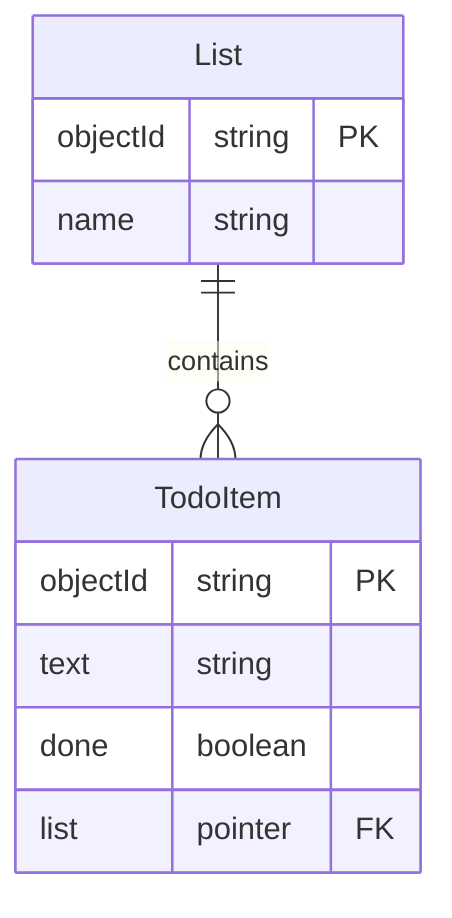

# Backends, Low-Code Backends, and the Parse Platform

Motivation - we want to be full-stack web developers :) But we don't have much time.

## What a backend is

### "Backend" only means something relative to a front-end
- **Relative term** - defined in opposition to the *front-end*
	- **Front-end** -- code that runs in the user's browser and handles presentation and user interaction
	- **Back-end** -- handles data processing, storage, and security

*Note:* Client / front-end are going to be used interchangeably in this lecture

### Client-server is the arrangement, and the backend is the server half

The pair has a name, and it is older than the web: a ***client-server architecture***. 

The **client** runs on the user's machine and asks for things; the **server** runs somewhere else and answers.


The detail that matters is the one the picture shows and the phrase does not: **there are many clients and one server.** Nearly everything in the next three weeks follows from that asymmetry.

- **The server is the only shared thing**, so it is the only place where two users can meet. Sharing a to-do list is possible because there is one copy of it and both browsers are talking to that copy.
- **The server is the only trusted thing.** Every client runs on somebody else's computer, in code they can read and change. Anything you need to be *true* has to be enforced on the server — which is next week's lecture in one sentence.
- **The server is far away.** Between the asking and the answering there is a network, and your interface has to have something to show meanwhile.


### The backend owns everything the browser cannot be trusted with
- Authentication (proving that a user is who they say they are)
- Authorization (checking what a user is allowed to do)
- Session management (tracking a user across requests, so they don't log in again on every click)
- Business logic and DB access
- Scheduled jobs (e.g., `cron`, backups, etc.)
- API endpoints / request handling (since the backend receives and responds to requests)
- Data validation (ensuring incoming data is correct/safe)

### A traditional backend is eight pieces of infrastructure before a line of your own code

1. **Machine** setup (or create a VM with a cloud provider)
2. **Operating system** installation & configuration
3. Security & **firewall** configuration
4. **Database** management system (DBMS)
5. **Web server** (e.g. nginx, apache2)
6. **Application server** / runtime environment
7. **Logging, monitoring & analytics**
8. **Backup** system

Note that none of the eight is on the previous list. That list was about *responsibilities*; this one is about the *machinery* you would have to assemble before you could discharge a single one of them.

## A low-code backend hands you some of the eight, already built

The infrastructure arrives already assembled, and what you get is an API: pre-built solutions for the needs that every application has, so that the only code you write is the code particular to yours.

The term you will meet in industry is **backend-as-a-service** (BaaS), and it is *not* a synonym for *low-code backend*. **Low-code** says how much you have to write. **As-a-service** says who runs it. Two different questions — and the three names you will hear answer them differently:

- **Parse Platform** is **low-code** — open-source software. You rent a virtual machine in the cloud and install it there, or you run it on your own laptop while you are developing.
- **Firebase** is **as-a-service** — proprietary, hosted by Google; renting it is the only way to have it.
- **Back4App** is **Parse-as-a-service** — somebody else running the low-code backend you could have run yourself.

They are not three of the same kind of thing. Parse is a *program*. Firebase is a *service*. Back4App is a *service that runs the program*.

Which is also why the code you write against Parse does not care: rent it or host it, only the URL changes.

**Supabase** and **Pocketbase** belong in the same conversation — open source, and deliberately Firebase-shaped alternatives to it. Same idea as Parse, different lineage.


## Parse is an open-source low-code backend

### It is open source now, but Parse started as a startup, then got bought by Facebook, and is now opened

Startup => Facebook => [Open Source](https://github.com/parse-community)

### Parse is a Node server

Implemented in JS - runs on Node (remember that JS can run in the browser or on the server via `node`)

### Parse also offers you an easy to use Javascript SDK so it's easier for your front-end to communicate with the backend

SDK
- stands for (software development kit)
- represents a library that makes it easy for you to communicate from the frontend to the backend

### Everything you do to Parse goes through the JavaScript SDK
- There are also SDKs for other languages than JS (Kotlin for Android, Swift for iOS, etc.)

### Parse has an answer for every line of that list

| The backend owns...          | Parse gives you                                                                          |
| ---------------------------- | ---------------------------------------------------------------------------------------- |
| Authentication               | `Parse.User` — signup, login, sessions (*next week*)                                     |
| Authorization                | class-level permissions and ACLs (*next week*)                                           |
| Session management           | completely free (handled by the SDK, and remembered across page reloads)                 |
| Business logic and DB access | the JavaScript SDK — the subject of today                                                |
| Scheduled jobs               | cloud jobs                                                                               |
| API endpoints                | REST and GraphQL, generated from your classes (although not needed when you use the SDK) |
| Data validation              | cloud code triggers (*week 11*)                                                 |

And two more that were never on the list, because the browser never had them to lose: **file storage**, and an interactive **dashboard** for looking at and editing your database by hand.

That is the argument for a low-code backend. Most of the infrastructure is handled, every responsibility on the list has an answer waiting, and what is left for you to write is the part that is actually yours.

## You can rent a Parse server, or run your own
### Back4App hosts Parse for you, and you leave with three keys

Steps to start working with the Back4App Parse deployment
1. Create an account on Back4App
2. Create a backend (app) for your react application in Back4App
3. Somewhere in settings find `APP_ID` and `JAVASCRIPT_KEY` and `PARSE_SERVER_URL` and save them for later

### You can host it yourself, and the client code is identical, the only thing that changes is that your client will talk to your own server IP or Domain (e.g. `api.zeeguu.org`) instead of `back4app.com`

- You can also [deploy your own server on DigitalOcean](Parse-Server-Deployment-Guide.md)
- I don't recommend it for this course, but if you want you can


## Replacing localStorage with a real database

*Note:* The full documentation is in the [Parse.js Javascript Guide](https://docs.parseplatform.org/js/guide/#saving-objects): use it as reference.

### Installing the SDK

```bash
npm install parse events
npm list parse
```

Check what the second command prints. It should say **`parse@8.6.0`** — the version we use in the course.

If it prints something older, npm has quietly handed you an old release, because Parse 8 wants Node 20, 22 or 24 and yours is not one of them. npm does not treat that as an error. Run `node --version`, fix Node, delete `node_modules`, and install again.

`parse` is the SDK. `events` provides the browser with `EventEmitter`, a class that Node has built in and the browser does not. Parse's code asks for it; if nobody answers, `Parse.initialize()` fails with `Emitter is not a constructor`. Installing `events` answers.

That failure has a shape you will meet again: `npm run build` **succeeds**, with at most a warning in the output. The app only dies when someone loads it. A green build is not evidence that anything works.

### One initialization at the top of the app, and every Parse call knows where to go

```js
import Parse from 'parse';

Parse.initialize("YOUR_APP_ID", "YOUR_JAVASCRIPT_KEY");
Parse.serverURL = "https://parseapi.back4app.com/"; // your PARSE_SERVER_URL
```

- By top of the app we mean either `main.jsx` or `App.jsx`
- This is sufficient because `Parse` is a singleton object — every other file that imports `parse` receives the same, already-configured object
- The initialization configures your react application to connect to
	- the server (`Parse.serverURL`)
	- the corresponding app (`YOUR_APP_ID`), because there might be multiple apps on the server

### Create and Save An Object to the Database

```js
import Parse from 'parse';

const TodoItem = Parse.Object.extend("TodoItem");

const newItem = new TodoItem();
newItem.set("text", "Call the landlord");
newItem.set("done", false);

newItem.save().then(onSave, onError);

function onSave(savedItem) {
	alert("saved a todo with id: " + savedItem.id);
}

function onError(error) {
	alert(error.message);
}
```

Steps:
1. `Parse.Object.extend("TodoItem")` creates a class for the object
2. `save()` - sends the data to the server
3. `save()` returns a *promise*, so we hand it two functions: one for when it worked, one for when it did not
4. The `TodoItem` class is automatically created in the database if it didn't exist - behavior that can be turned off, and which we *will* turn off next week, once you have met your first column created by a typo

The two functions are given names here on purpose. The same code is more often written with both of them inline, and that is how you will see it in the Parse documentation:

```js
newItem.save().then(
	(savedItem) => { alert("saved a todo with id: " + savedItem.id); },
	(error) => { alert(error.message); }
);
```

It is the same thing. It is easier to read when the two branches have names, and harder to forget that the second one exists.

### A query is a class, some constraints, and a `find()`

```js
const TodoItem = Parse.Object.extend("TodoItem");
const query = new Parse.Query(TodoItem);

query.equalTo("done", false);
query.ascending("createdAt");

const results = await query.find();

for (const item of results) {
	console.log(item.id + " - " + item.get("text"));
}
```

Steps:
- Create a class reference
- Create a query object
- Add constraints on the query object
- call `.find()`

`find()` returns a promise as well. From here on we use `await` rather than `.then()`, because the code then reads in the order in which it happens.

References:
- [Query Constraints](https://docs.parseplatform.org/js/guide/#query-constraints)
- [Queries on Arrays](https://docs.parseplatform.org/js/guide/#queries-on-array-values)
- [Queries on Strings](https://docs.parseplatform.org/js/guide/#queries-on-string-values)

Advanced Parse features, for when you need them
- [Atomic counters](https://docs.parseplatform.org/js/guide/#counters)
- [Atomic arrays](https://docs.parseplatform.org/js/guide/#arrays)


## Re-implementing the to-do list on top of Parse

You already have a working app. It has a list, a form, a checkbox and a delete button, and at the bottom of `ToDoList.jsx` it has this:

```jsx
useEffect(() => {
	localStorage.setItem("todos", JSON.stringify(todos));
}, [todos]);
```

One line, and everything is saved. Whenever anything about any to-do changes, the entire array is serialized and written again.

### The whole-array write is the first thing that has to go

With `localStorage` that line is free. It is the same machine, the list is a few kilobytes, and nobody notices.

Now put a network in the middle. Ticking one checkbox would upload every to-do you own. Two people editing the same list would overwrite each other wholesale, because each of them is writing the entire list as they last saw it. And there is no operation in the database for *replace everything*; there are operations for one object at a time.

So the single effect that wrote everything becomes **one call per change**:

| In the app the user does | In the database            |
| ------------------------ | -------------------------- |
| adds a to-do             | create one object          |
| ticks a checkbox         | save one object            |
| presses Delete           | destroy one object         |
| opens the page           | find all the objects, once |

This is not a Parse rule. It is what having a backend means.

### Where the Parse calls go: a service layer

Instead of calling Parse directly from our UI components, we put those calls in their own file — a **service layer**.

Without one, a component both renders the UI *and* talks to the database, which are two responsibilities (see the **Single Responsibility Principle**, in the further reading). Components get longer, and the same four lines of Parse setup get copied into every one of them:

```js
// in the component - messy, and about to be duplicated in the next component
const TodoItem = Parse.Object.extend("TodoItem");
const item = new TodoItem();
item.set("text", text);
item.set("done", false);
await item.save();
```

With a service layer the component says what it wants:

```js
// in the component - clean, simple
await createTodo(text);
```

Our services folder starts with a single file, `src/services/todoService.js`:

```js
import Parse from "parse";

const TodoItem = Parse.Object.extend("TodoItem");

// React is happier with plain JS objects than with Parse objects,
// and this is also where we unify the treatment of `id` with the other fields
function toPlainObject(parseObject) {
	return {
		id: parseObject.id,
		text: parseObject.get("text"),
		done: parseObject.get("done"),
	};
}

export async function fetchTodos() {
	const query = new Parse.Query(TodoItem);
	query.ascending("createdAt");   // oldest first
	const results = await query.find();
	return results.map(toPlainObject);
}

export async function createTodo(text) {
	const item = new TodoItem();
	item.set("text", text);
	item.set("done", false);
	return toPlainObject(await item.save());
}

export async function setTodoDone(id, done) {
	// we have the id, so we don't need to fetch the object before changing it
	const item = TodoItem.createWithoutData(id);
	item.set("done", done);
	return toPlainObject(await item.save());
}

export async function deleteTodo(id) {
	const item = TodoItem.createWithoutData(id);
	await item.destroy();
}
```

`toPlainObject` is the only place in the whole app that knows a field is called `"text"`. Everywhere else, a to-do is `{ id, text, done }` — the same shape it had when it lived in `localStorage`, which is why the components barely change.

`createWithoutData(id)` builds a reference to an object that already exists on the server, without fetching it. You can then set a field and save, or destroy it, and only that travels over the network.

### And the component

The effect that *wrote* everything is replaced by an effect that *reads* everything, once:

```jsx
import { useState, useEffect } from "react";
import { fetchTodos, createTodo, setTodoDone, deleteTodo } from "../services/todoService";

export default function ToDoList({ firstName }) {
	const [todos, setTodos] = useState([]);

	useEffect(() => {
		async function load() {
			setTodos(await fetchTodos());
		}
		load();
	}, []);

	async function handleAdd(newTask) {
		const created = await createTodo(newTask);
		setTodos([...todos, created]);
	}

	async function handleDelete(idToDelete) {
		await deleteTodo(idToDelete);
		setTodos(todos.filter((each) => each.id !== idToDelete));
	}

	async function handleToggle(id) {
		const todo = todos.find((t) => t.id === id);
		await setTodoDone(id, !todo.done);
		setTodos(todos.map((t) => (t.id === id ? { ...t, done: !t.done } : t)));
	}

	// ... the JSX is unchanged
}
```

Every handler now does the same two things in the same order: **change the database, then change the state**. The `useEffect` that used to synchronize the two is gone, because there is nothing left for it to synchronize.

The version above is not finished: it assumes the data arrives.


## A backend is slow, and your components have to show when the user has to wait for data to be retrieved

Everything you have fetched so far was instant. `localStorage` is synchronous — the data is already on the machine, so the line after `getItem` has it. That is why this worked:

```jsx
let [todos, setTodos] = useState(loadTodos);
```

A backend is on the other side of a network, and the round trip is somewhere between fifty milliseconds and, on a bad train connection, several seconds. Which means there is now a moment that did not exist before: the component has rendered, and the data has not arrived.

During that moment, `useState([])` gives an empty array, so the list renders — and your app already contains the line that will lie about it:

```jsx
{todos.length === 0 ? <>Nothing to do</> : ( ... )}
```

**The screen says "Nothing to do" when the truth is "I do not know yet."** Those are different things, and the user cannot tell them apart.

Fetched data does not arrive as one state; it arrives as several, and all of them have to be rendered. That is [The Three States of Remote Data](../React/The-Three-States-of-Remote-Data.md), and every component you write from here on has them.

## Model your domain before you create a second table

So far there is one class, and no modeling was required: a to-do has a text and a done flag, and that is the whole design. You need to think ahead about the database model as soon as there is more than one kind of thing in your application.

The main questions are
1. What are the types of objects in my domain model?
2. What are the relationships between them?

### A second class: to-dos belong to lists

A single flat pile of to-dos stops being useful somewhere around thirty items. What people actually want is *Personal*, *Apartment*, *Bachelor project* — several lists, each with a name. So:



Note what we did *not* do: we did not add a `list` string field to `TodoItem`. A string would be enough to group them on screen today, and it would be useless the moment anyone wants to rename a list — or share one, which is next week's whole subject.

And note the three names now in play, each in its own layer: `List` is a class in the database, `ToDoList` is the React component that draws one, and an *array* is a JavaScript value. Different things, so different names.

##### Obs: the same idea has three names, depending on who is talking

| In a relational database | In Parse           | In OO lingo |
| ------------------------ | ------------------ | ----------- |
| table                    | class              | class       |
| row                      | object             | object      |
| column                   | field              | attribute   |
| foreign key              | **pointer**        | a reference |
| join table               | a class with two pointers | — |

So yes: **a pointer is Parse's foreign key.** It holds which object in which class, and nothing else.

### Every relationship you will model is one-to-many or many-to-many

#### One-to-many relationships are done with pointers

Set a pointer by handing `set()` the whole object, not its id:

```js
const List = Parse.Object.extend("List");
const TodoItem = Parse.Object.extend("TodoItem");

const item = new TodoItem();
item.set("text", "Call the landlord");
item.set("done", false);
item.set("list", apartmentList);   // ← the object itself, not its id
await item.save();
```

Now we can query all the to-dos in a list:

```js
const query = new Parse.Query(TodoItem);
query.equalTo("list", apartmentList);
const results = await query.find();
```

or get the list a to-do belongs to:

```js
const list = item.get("list");
```

with one catch that will bite you: what comes back from `get("list")` is a Parse object that knows its `id` but has **not** fetched its fields. Asking it for `get("name")` gives you `undefined`. Either fetch it, or — much better — tell the query to bring the lists along:

```js
const query = new Parse.Query(TodoItem);
query.include("list");          // ← fetch the pointed-to objects too
const results = await query.find();
results[0].get("list").get("name");   // now this works
```

One request instead of one-per-to-do. We will have more to say about this in the lecture on efficient communication with the backend.

#### Many-to-many relationships are done with a join table

Say a to-do can be tagged with several labels, and a label applies to many to-dos. Create a class whose job is to represent one pairing:

```js
const TodoLabel = Parse.Object.extend("TodoLabel");

const todoLabel = new TodoLabel();
todoLabel.set("todo", todoItem);
todoLabel.set("label", label);
await todoLabel.save();
```

Two pointers, one per side. That is all a join table is.

##### Why a join table rather than anything cleverer?

Because the relationship itself will eventually want to carry information, and only a class can hold information:

```js
todoLabel.set("addedBy", someUser);
todoLabel.set("addedAt", new Date());
todoLabel.set("order", 1);
```

The moment you need *when* the label was added, or *who* added it, or in *what order*, a join table already has room for it and the alternatives do not.

> *You will meet `Parse.Relation` in the documentation*, which is Parse's built-in way of doing many-to-many. It is less typing and it cannot carry any information about the relationship, so we are not going to use it. Knowing that it exists is enough.

#### Do not model relationships with arrays

Parse lets you store an array of objects in a field, and it is tempting for small collections. Resist it: an array has no room for information about the relationship, it has to be rewritten in full to add one element — the whole-array problem from the beginning of this lecture, all over again — and it gets slow and awkward as soon as it is not tiny. Pointers for one-to-many, a join table for many-to-many. Those two cover everything you need this semester.

### The notation matters less than being able to explain your model

Use whichever notation you prefer. Two that I like are:
1. On the left hand side is the most popular way of showing attributes
	- crow's feet show cardinality
	- attributes are listed in the box
2. On the right hand side is a compressed approach proposed by Søren Lauesen, ex-professor at ITU


No matter which notation you use, the most important aspect is being able to communicate the way all the relevant data for your application domain is saved in the database.

## Project Work
- Design a **domain model** for your application by **creating an ER diagram**. The diagram will be part of your final report. Discuss your diagram with the staff. Make sure to keep it up to date as your project progresses. As you work on your implementation you will realize that you need to constantly refine it. Keep it up to date.
- Create the tables corresponding to your ER diagram in Back4App
- Start connecting your React application to your own Parse backend


## Further reading
- SOLID principles
	- **Single Responsibility Principle** - the one behind the service layer
	- Open-closed Principle
	- Liskov Substitution
	- Interface Segregation
	- **Dependency Injection Principle**


## Exam Questions

### 1. What is the difference between front-end and back-end?

### 2. List at least 5 responsibilities of a backend.

### 3. What is Parse Platform and what does it provide?

### 4. What does CRUD stand for and what do each of the letters represent?

### 5. Explain what this code does:
```js
const TodoItem = Parse.Object.extend("TodoItem");
const newItem = new TodoItem();
newItem.set("text", "Buy milk");
newItem.set("done", false);
await newItem.save();
```

### 6. This code was fine when the to-dos were in `localStorage`. Why is it no longer acceptable once they live on a server, and what replaces it?
```jsx
useEffect(() => {
  localStorage.setItem("todos", JSON.stringify(todos));
}, [todos]);
```

### 7. What are two benefits of placing this code in a separate service file rather than directly in a React component?
```js
export async function fetchTodos() {
  const query = new Parse.Query(TodoItem);
  query.ascending("createdAt");
  const results = await query.find();
  return results.map(toPlainObject);
}
```

### 8. What is wrong with this query pattern, and which single line fixes it?
```js
const query = new Parse.Query("TodoItem");
const todos = await query.find();

for (let todo of todos) {
  const list = todo.get("list");
  await list.fetch();
  console.log(list.get("name"));
}
```

### 9. How would you query all TodoItems where done is false, ordered by creation date?

### 10. Why is a join table preferred over an array field for a many-to-many relationship?


## References

The documentation on ParsePlatform.org
- [Getting Started Guide](https://docs.parseplatform.org/js/guide/#getting-started) - extensive reference for everything ParseJS
- [Relationships](https://docs.parseplatform.org/js/guide/#relations) - this is very good and must be read attentively -- it will really help with modeling


<!-- Staff notes, hidden from the published page and the chapter.
History
- Sep '26 - Restructured. Authentication moved out to the Authorization note (auth + authz belong together).
            The lecture is now "replace localStorage with a real DB", worked on todo-26 rather than on GameScore.
            Service layer moved here from the Authorization note, since the need arises here.
            Modeling appears only where relationships appear. Arrays and Parse.Relation demoted to warnings.
            Vite detour deleted: `npm install parse events` + a bare `import Parse from 'parse'` works in dev
            and in a production build (verified against parse 8.6.0 / vite 7.3.6).
- Oct '25 - Improved structure - made the page more stand-alone - less external references
- Nov '24 - better organized the references
To do
- Nov '24 - spend more time discussing the Relationships
- Sep '26 - todo-26 still needs the matching commit: `npm install parse events`, per-item service calls, the three states.
-->
