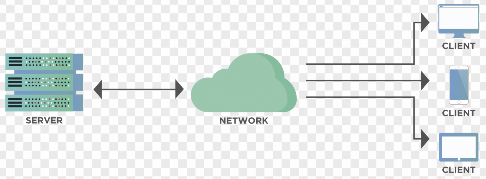
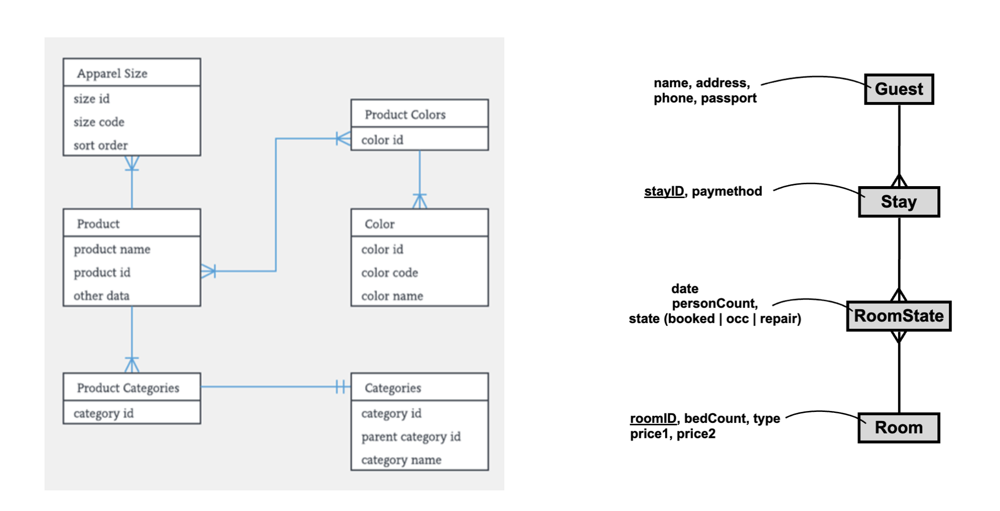

# Backends and the Parse Platform

Motivation - we want to be full-stack web developers :) But we don't have much time.

## A backend is everything your React app cannot do by itself

### "Backend" only means something relative to a front-end
- **Relative term** - defined in opposition to the *front-end*
	- **Front-end** -- code that runs in the user's browser and handles presentation and user interaction
	- **Back-end** -- handles data processing, storage, and security
- The server side in a ***client-server architecture***




### The backend owns everything the browser cannot be trusted with
- Authentication (proving that a user is who they say they are)
- Authorization (what can a user do)
- Session management for web applications
- Business logic and DB access
- Scheduled jobs (e.g., `cron`)
- API endpoints / request handling (since the backend receives and responds to requests)
- Data validation (ensuring incoming data is correct/safe)

### A traditional backend is eight pieces of infrastructure before a line of your own code
- Machine setup (or create a VM with a cloud provider)
- Operating system installation & configuration
- Security & firewall configuration
- Database management system (DBMS)
- Web server (e.g. nginx, apache2)
- Application server / runtime environment
- Logging, monitoring & analytics
- Backup system


### A low-code backend hands you all eight as a service
- Pre-built solutions for common backend needs
- Backend-as-a-service
	- Firebase = proprietary, hosted by Google
	- Back-for-App.com = a deployment of Parse
- Self-hostable
	- **Parse Platform** = open source framework


## Parse is an open-source backend you do not have to build

### Parse was a startup, then Facebook's, and is now open source

Startup => Facebook => [Open Source](https://github.com/parse-community)

### Parse is a Node server, plus an SDK you install in your client

Implemented in JS - runs on Node

Offers
- **Server**
	- Authentication
	- Authorization
	- File storage
	- APIs (REST & GraphQL)
	- Interactive Dashboard for DB Management
	- Cloud functions
- **Client**
	- Javascript SDK in the `parse` wrapper library for the client
	- SDKs for other languages and UI frontends (Android, iOS, etc.)


## You can rent a Parse server, or run your own
### Back4App hosts Parse for you, and you leave with three keys

Steps to start working with the Back4App Parse deployment
1. Create an account on Back4App
2. Create a backend (app) for your react application in Back4App
3. Somewhere in settings find `APP_ID` and `JAVASCRIPT_KEY` and `PARSE_SERVER_URL` and save them for late

### You can host it yourself, and the client code is identical

- You can also [deploy your own server on DigitalOcean](Parse-Server-Deployment-Guide.md)


## Everything you do to Parse goes through the JavaScript SDK

The full documentation is in the [Parse.js Javascript Guide](https://docs.parseplatform.org/js/guide/#saving-objects)
- use as reference

### One initialisation at the top of the app, and every Parse call knows where to go

- install the parse JS SDK (software development kit) `npm install -S parse`
- configure your react application to connect to the server and corresponding app (there might be multiple apps on the server)
```js

// **Important** to use the minified version 
import Parse from "parse/dist/parse.min.js";


Parse.initialize("YOUR_APP_ID", "YOUR_JAVASCRIPT_KEY");
//javascriptKey is required only if you have it on server.

Parse.serverURL = 'http://YOUR_PARSE_SERVER:1337/parse'
```
Note: code above should be in the top level component of our app

Note 2: if you don't want to import the minified version, see the [Parse-Configuration-for-Vite](Parse-Configuration-for-Vite.md) . If you change the Vite configuration, then you can write `import Parse from 'parse'` which is nicer.

### Create, retrieve, update and delete is the whole vocabulary

*To Read*: [CRUD operations with Parse](https://www.back4app.com/docs/react/data-objects/react-crud-tutorial) (approx. 30min)

CRUD(O) stands for
- Create
- Retrieve
- Update
- Delete
- Overview

#### Creating and Saving a New Object to the Database

```javascript
import Parse from 'parse';

const TodoItem = Parse.Object.extend("TodoItem");
const newItem = new TodoItem();
newItem.set("name", input);
newItem.set("done", false);
newItem.save().then(
	(newObj) => {
		alert("saved a todo with id: " + newObj.id);
	},
	(error) => {
		alert(error.message);
	}
);
```

Steps:
1. Creating a class for the object
2. `save()` - sends the data to the server
3. save returns a *promise* so we  have to unpack it `save.then( (obj) => {...})`
4. The `Counter` class is automatically been created in the database if it didn't exist - behavior that can be turned off

Advanced Parse functionalities:
- [saving objects when offline](https://docs.parseplatform.org/js/guide/#saving-objects-offline) with `saveEventually`


#### Retrieving an Object

Imagine you have a GameScore object.
```js
const GameScore = Parse.Object.extend("GameScore");
const query = new Parse.Query(GameScore);

// you must have the gameScoreId

query.get(gameScoreId)
	.then((gameScore) => {
		const score = gameScore.get("score");
		const playerName = gameScore.get("playerName");
		const cheatMode = gameScore.get("cheatMode");
		
		// or
		const { score, playerName, cheatMode } = gameScore.attributes;
		
		// note, id is a special kind of property - you don't get with get
		const objectId = gameScore.id;
		
	}, (error) => {
  // The object was not retrieved successfully.
  // error is a Parse.Error with an error code and message.
});
```

#### Updating an Object

```js

// Create the object.
const GameScore = Parse.Object.extend("GameScore");
const gameScore = new GameScore();

gameScore.set("score", 1337);
gameScore.set("playerName", "Sean Plott");
gameScore.set("cheatMode", false);
gameScore.set("skills", ["pwnage", "flying"]);


gameScore.save().then((gameScore) => {
  // Now let's update it with some new data. In this case, only cheatMode and score
  // will get sent to the cloud. playerName hasn't changed.
  // .... 
  // The updating part!! ! 
  gameScore.set("cheatMode", true);
  gameScore.set("score", 1338);
  return gameScore.save();
});

```

Advanced Parse features
- [Atomic counters](https://docs.parseplatform.org/js/guide/#counters)
- [Atomic arrays](https://docs.parseplatform.org/js/guide/#arrays)


### A query is a class, some constraints, and a `find()`

Most basic way to query for objects is:
```jsx
const GameScore = Parse.Object.extend("GameScore");
const query = new Parse.Query(GameScore);

query.equalTo("playerName", "Dan Stemkoski");
const results = await query.find();
alert("Successfully retrieved " + results.length + " scores.");
// Do something with the returned Parse.Object values
for (let i = 0; i < results.length; i++) {
  const object = results[i];
  alert(object.id + ' - ' + object.get('playerName'));
}
```
Steps:
- Create a class reference
- Create a query object
- Add constraints on the query object
- call `.find()`

References:
- [Query Constraints](https://docs.parseplatform.org/js/guide/#query-constraints)
- [Queries on Arrays](https://docs.parseplatform.org/js/guide/#queries-on-array-values)
- [Queries on Strings](https://docs.parseplatform.org/js/guide/#queries-on-string-values)


### Parse gives you accounts, login and the current user without your writing any of it

#### Account Creation and Authentication

The Javascript Parse SDK helps you manage user accounts and track the logged in user.

The following example is a simple page that either creates an account or logs in the user.

```jsx
import { useState } from 'react';
import Parse from 'parse';

function Auth() {
  const [username, setUsername] = useState('');
  const [password, setPassword] = useState('');
  const [error, setError] = useState('');

  const handleSignUp = async (e) => {
    e.preventDefault();
    setError('');
    try {
      const user = new Parse.User();
      user.set('username', username);
      user.set('password', password);
      await user.signUp();
      
      // programatically redirect to /home
    } catch (err) {
      setError(err.message);
    }
  };

  const handleLogin = async (e) => {
    e.preventDefault();
    setError('');
    try {
      await Parse.User.logIn(username, password);
      
      // programatically redirect to /home
    } catch (err) {
      setError(err.message);
    }
  };

  return (
    <div>
      <h1>Auth</h1>
      {error && <p style={{ color: 'red' }}>{error}</p>}
      
      <form>
        <input
          type="text"
          placeholder="Username"
          value={username}
          onChange={(e) => setUsername(e.target.value)}
        />
        <input
          type="password"
          placeholder="Password"
          value={password}
          onChange={(e) => setPassword(e.target.value)}
        />
        <button onClick={handleSignUp}>Sign Up</button>
        <button onClick={handleLogin}>Log In</button>
      </form>
    </div>
  );
}

export default Auth;
```

What happens:
- `Parse.User.signUp()` creates a new user
- `Parse.User.logIn()` logs in existing user
- Both methods automatically manage the session
- Log out: `await Parse.User.logOut()`


#### Getting the current user

It would be silly if the user had to login every time they opened the app Parse stores info about the logged in user in LocalStorage
```jsx
const currentUser = Parse.User.current();
if (currentUser) {
    // do stuff with the user
} else {
    // show the signup or login page
}
```

#### Logging out the current user

```jsx
Parse.User.logOut().then(() => {
  const currentUser = Parse.User.current();  // this will now be null
});
```

#### Associating users with other tables

Example of storing a `Post` for a `User`.
- Create an attribute on the `Post`
- Query the posts for that user

```js
const user = Parse.User.current();

// Make a new post
const Post = Parse.Object.extend("Post");
const post = new Post();
post.set("title", "My New Post");
post.set("body", "This is some great content.");
post.set("user", Parse.User.current());

await post.save();


// Find all posts by the current user
const query = new Parse.Query(Post);
query.equalTo("user", Parse.User.current());
const userPosts = await query.find();
// userPosts contains all of the posts by the current user.
});
```


More advanced features
- [Email Verification](https://docs.parseplatform.org/js/guide/#verifying-emails)
- [Security of User Objects](https://docs.parseplatform.org/js/guide/#security-for-other-objects) - only a user can modify it's own data
- [Resetting Passwords](https://docs.parseplatform.org/js/guide/#resetting-passwords)


## A backend is slow, and your components have to show it

### An empty list and a list that has not arrived yet look identical

Everything you have fetched so far was instant. `localStorage` is synchronous — the data is already on the machine, so the line after `getItem` has it. A backend is on the other side of a network, and the round trip is somewhere between fifty milliseconds and, on a bad train connection, several seconds.

Which means there is now a moment that did not exist before: the component has rendered, and the data has not arrived.

Look at what your app shows during that moment. `useState([])` gives an empty array, so the list renders — empty. **The screen says "you have no to-dos" when the truth is "I do not know yet."** Those are different things, and the user cannot tell them apart.

So the arrival of the data has to become state too:

```jsx
function TodoList() {
  const [todos, setTodos] = useState([]);
  const [status, setStatus] = useState("loading");

  useEffect(() => {
    async function fetchTodos() {
      try {
        const query = new Parse.Query(Parse.Object.extend("Todo"));
        setTodos(await query.find());
        setStatus("ready");
      } catch (error) {
        console.error(error);
        setStatus("failed");
      }
    }
    fetchTodos();
  }, []);

  if (status === "loading") return <p>Loading your to-dos…</p>;
  if (status === "failed") return <p>Could not reach the server. Try again.</p>;

  return (
    <ul>
      {todos.map((todo) => (
        <li key={todo.id}>{todo.get("title")}</li>
      ))}
    </ul>
  );
}
```

**Three states, not two.** Loading, failed, and ready — and the reason the failed one is not optional is that without it a dead network looks exactly like an empty list. The user retries nothing, because as far as they can see nothing went wrong. A `catch` that only writes to the console is a bug with a comforting shape: you see the error while developing, and your users never do.

The rendering itself is nothing new — it is the early-return form of [conditional rendering](../React/Conditional-Rendering.md), which is why that note showed you three shapes and said the `if` was the one for whole-screen decisions. This is the screen it meant.

**What you render is a design decision.** `<p>Loading…</p>` is honest and takes a minute. A spinner is a rotating element in CSS, and there is nothing React-specific about it. Better than either, when you know the shape of what is coming, are **skeleton rows** — grey blocks the size of the real to-dos — because the layout does not jump when the data lands.

One thing worth knowing before you reach for a spinner: if the data usually arrives in 200ms, a spinner appears and disappears before the eye resolves it, and the flicker reads as a glitch rather than as progress. Showing nothing for the first few hundred milliseconds often looks *faster* than showing a spinner immediately.

### The same three states in every component is the argument for a custom hook

Every screen that fetches needs these three states, which means you will write this same `useState` triple in every component that talks to Parse. That repetition is the standard argument for a **custom hook** — one `useTodos()` that returns `{ todos, status }` and keeps the wiring in one place. That is [Component Extraction](../Structure/Component-Extraction-Guide.md) applied to logic rather than to markup; you do not need it in week 4, but notice the duplication when it arrives.


## Model your domain before you create a single table


You must think ahead about the database model for your application.

The main questions are
1. What are the types of objects in my domain model?
2. What are the relationships between them?


### Every relationship you will model is one-to-many or many-to-many

#### One-to-many Relationships

Can be implemented with
1. Pointers - the default one
2. Arrays - for special situations where the "many" are "few" :)

##### Creating a relationship with pointers
```jsx
var game = new Parse.Object("Game");
game.set("createdBy", Parse.User.current());
```

now we can query all the games of a user using:
```js
var query = new Parse.Query("Game");
query.equalTo("createdBy", Parse.User.current());
```
of get the user who created a game:

```js
// say we have a Game object
var game = ...

// getting the user who created the Game
var user = game.get("createdBy");
```
##### Creating a relationship with arrays (not recomended)

```js
// let's say we have four weapons
var scimitar = ...
var plasmaRifle = ...
var grenade = ...
var bunnyRabbit = ...

// stick the objects in an array
var weapons = [scimitar, plasmaRifle, grenade, bunnyRabbit];

// store the weapons for the user
var user = Parse.User.current();
user.set("weaponsList", weapons);
```

To retrieve the Weapon objects:
```js
var weapons = Parse.User.current().get("weaponsList")
```
#### Many-to-Many Relationships

Can be implemented in two ways
1. Using the Parse Relation attribute type
2. Using join tables

##### Using Parse Relations

###### Defining a relation between authors and books

```js
// let’s say we have a few objects representing Author objects
var authorOne = ...
var authorTwo = ...
var authorThree = ...

// now we create a book object
var book = new Parse.Object("Book");

// now let’s associate the authors with the book
// remember, we created a "authors" relation on Book
var relation = book.relation("authors");
relation.add(authorOne);
relation.add(authorTwo);
relation.add(authorThree);

// now save the book object
book.save();
```
###### Getting the authors of a book

```js
// suppose we have a book object
var book = ...

// create a relation based on the authors key
var relation = book.relation("authors");

// generate a query based on that relation
var query = relation.query();

// now execute the query
```
###### Getting all the books to which an author has contributed

```js
// suppose we have a author object, for which we want to get all books
var author = ...

// first we will create a query on the Book object
var query = new Parse.Query("Book");

// now query the authors relation to see if the author object we have is contained therein
query.equalTo("authors", author);
```

Note
- the `equalTo` is not intuitive

##### Using Join Tables (better this!)

Create a new kind of entity that maps one authors to one book.
```javascript
var author = ...

// create an entry in the BookAuthor table
var bookAuthor = new Parse.Object("BookAuthor");
bookAuthor.set("book", book);
bookAuthor.set("author", author);
bookAuthor.save();
```

This is always more powerful from the point of view of modeling!

###### Why are Join Tables more powerful than relationships? 

Because they allow you to model the relationship in a more rich manner later! E.g. if you need to know author order, or the type of contribution (editor, primary author, co-author, etc.)
```javascript
var author = ...

// create an entry in the BookAuthor table
var bookAuthor = new Parse.Object("BookAuthor");
bookAuthor.set("book", book);
bookAuthor.set("author", author);
bookAuthor.set("role", "primary author");
bookAuthor.set("order", 1);
bookAuthor.set("dateAdded", Date());
bookAuthor.save();
```


### The notation matters less than being able to explain your model

Use whichever notation you prefer. Two that I like are:
1. On the left hand side is the most popular way of showing attributes
	- crow's feet show cardinality
	- attributes are listed in the box
2. On the right hand side is a compressed approach proposed by Søren Lauesen, ex-professor at ITU



No matter which notation you use, the most important aspect is being able to communicate the way all the relevant data for your application domain is saved in the database.
## Project Work
- Design a **domain model** for your application by **creating an ER diagram**. The diagram will be part of your final report. Discuss your diagram with the staff. Make sure to keep it up to date as your project progresses. As you work on your implementation you will realize that you need to constantly refine it. Keep it up to date.
- Create the tables corresponding to your ER diagram in Back4App
- Start connecting your React application to your own Parse backend


## Exam Questions

### 1. What is the difference between front-end and back-end?

### 2. List at least 5 responsibilities of a backend.

### 3. What is Parse Platform and what does it provide?

### 4. What does CRUD stand for and what do each of the letters represent?

### 5. Explain what this code does:
```js
const TodoItem = Parse.Object.extend("TodoItem");
const newItem = new TodoItem();
newItem.set("name", "Buy milk");
newItem.set("done", false);
await newItem.save();
```

### 6. What is wrong with this query pattern?
```js
const query = new Parse.Query("Post");
const posts = await query.find();

for (let post of posts) {
  const userQuery = new Parse.Query("User");
  const user = await userQuery.get(post.get("userId"));
  console.log(user.get("username"));
}
```

### 7. How do you get the currently logged-in user in Parse?

### 8. Explain the difference between Pointers and Relations in Parse.

### 9. How would you query all TodoItems where done is false, ordered by creation date?

### 10. Why are Join Tables often preferred over Parse Relations for many-to-many relationships?

### 11. A component fetches its data in a `useEffect` and starts with `useState([])`. Before the data arrives, what does the user see, and why is that a problem? What are the three states the component actually has?


## References

The documentation on ParsePlatform.org
- [Getting Started Guide](https://docs.parseplatform.org/js/guide/#getting-started) - extensive reference for everything ParseJS
- [Relationships](https://docs.parseplatform.org/js/guide/#relations) - this is very good and must be read attentively -- it will really help with modeling


<!-- Staff notes, hidden from the published page and the chapter.
History
- Oct '25 - Improved structure - made the page more stand-alone - less external references
- Nov '24 - better organized the references
To do
- Nov '24 - spend more time discussing the Relationships
-->
