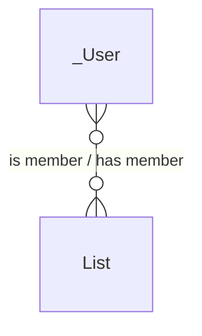
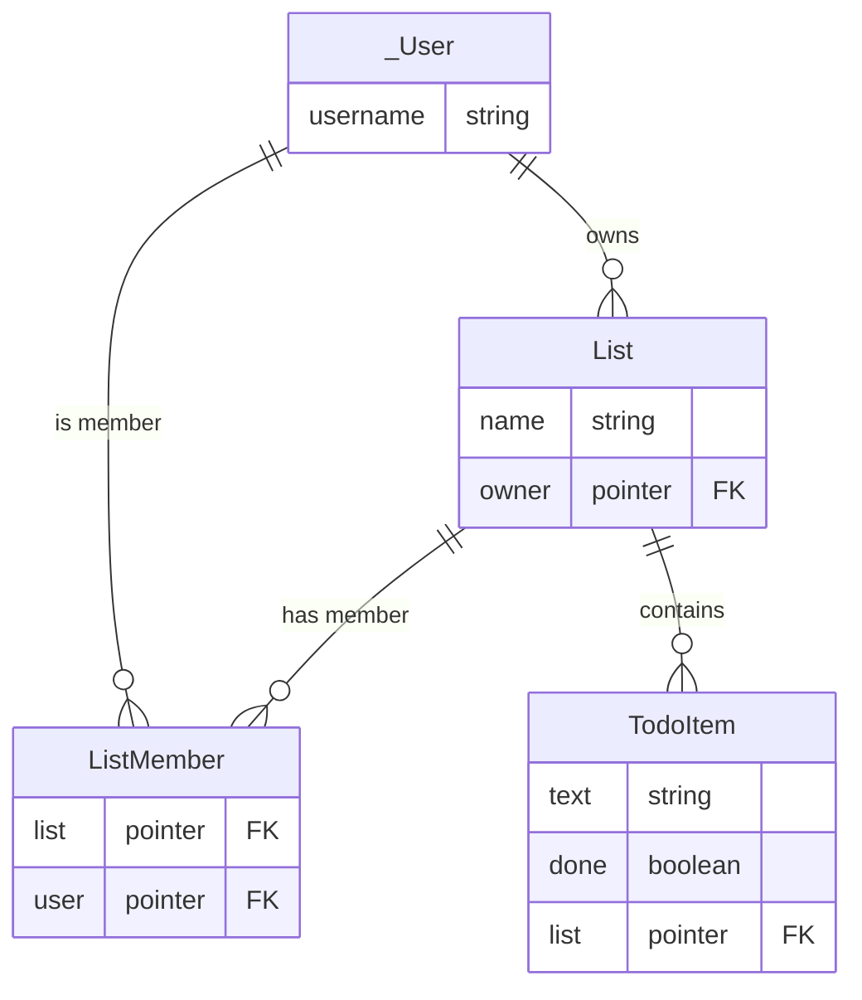
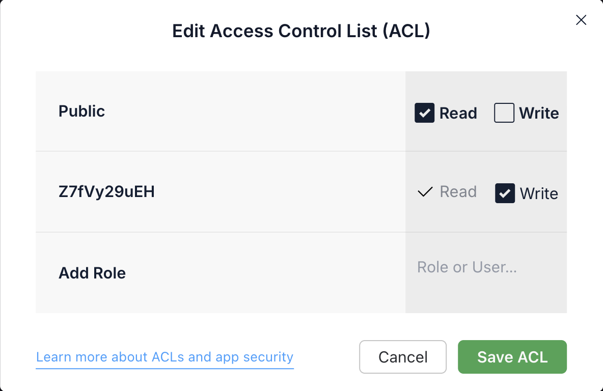
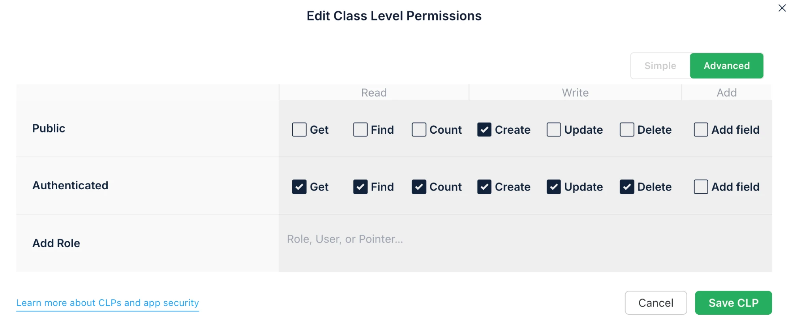
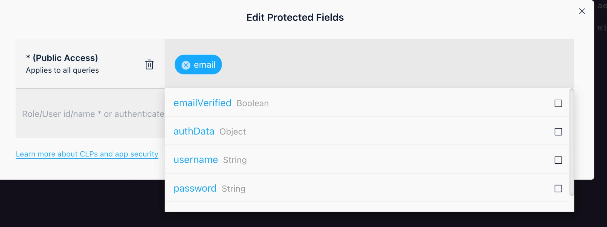

# Sharing a List Is a Many-to-Many Relationship

It follows on from [Relationships Between Object Classes](Relationships-Between-Object-Classes.md), where a to-do got an owner and lists got to-dos, and from [Authentication and Authorization](Authorization-and-ACL-in-Parse.md), where ACLs decided who may read what.

Ada is moving, and wants to share *Apartment* with Armin, who is helping her. A list can be shared with many users, and a user can have many lists shared with them. That is a **many-to-many** relationship. Every project in this course has one, because sharing at the list level is part of the required core.

On a whiteboard it is one line, with *many* at both ends. Read it left to right, a user is a member of many lists, and back, a list has many members:



A database cannot store that line as it is. A pointer holds exactly one object, so it can only ever be the *one* end of a relationship. Where the line goes instead is the whole question of this note.

The ACL cannot be that place either. It can let Armin *read* the list, but it is a permission, not a relationship, as at the [start of the Relationships note](Relationships-Between-Object-Classes.md#the-first-relationship-a-to-do-has-an-owner): nobody can ask it "which lists are shared with me?". And it belongs to the list, which is Ada's. When the move is done and Armin wants *Apartment* off his screen, he cannot take himself off; with write access he could, but that is also the right to rename the list, delete it, or remove Ada.

So the membership gets a row of its own: one that Armin may delete, without being allowed to touch the list. A row also has room for anything you need to *store* about the membership: whether he may edit, an invitation he has to accept first.

## The line becomes a table: the join table `ListMember`

Create a class whose job is to represent one membership: one row says *this user is on this list*.



The line from the whiteboard has become a table. Two pointers, one per side. That is all a join table is: two one-to-many relationships, meeting in the middle.

You will also meet it as a *junction*, *association* or *mapping* table, named after its two sides: `UserListMap`, or `lists_users` in Rails. That name says how the table works. Once it stores something about the relationship, like whether this member may edit, name it after what one row *is*: a membership. "Armin left the list" deletes a `ListMember`; nobody says they deleted a mapping.

Create the class in the dashboard first, the way you created `List`: a `ListMember` class with two Pointer columns, `list` to `List` and `user` to `_User`. Whether the client may create a class by saving to it depends on how your app is set up. Creating it by hand means you never have to find out in front of anybody.

## Ada finds Armin by his exact username, if his row lets her

Sharing needs Armin as a `Parse.User`. The smallest way to get him: one text input where Ada types his username, exactly.

```js
const friend = await new Parse.Query(Parse.User)
	.equalTo("username", name)
	.first();              // undefined if nobody has that username

if (!friend) {
	setError("No user with that name");
	return;
}
await shareList(list, friend);
```

No search, no autocomplete: less code, and better privacy, because Ada can only find someone whose username she already knows.

For the lookup to find Armin, three settings on `_User` have to agree.

### A new user's row is private, so sign-up makes it readable

Out of the box, a user's row is readable only by that user, and the lookup finds nobody. Sign-up makes it readable:

```js
await user.signUp();

const acl = new Parse.ACL(user);   // I may change my row
acl.setPublicReadAccess(true);     // others may find me
user.setACL(acl);
await user.save();
```

That only helps users who sign up from now on. If your database already has users, their rows are still private, and sharing with them fails with *No user with that name*, although they exist. Tick **Public Read** on each of them, by hand, in the dashboard:



### The class lets only logged-in users ask

An ACL cannot say "logged-in users", so the class-level permissions do. **Public** keeps only **Create**, because signing up is creating a user, and whoever signs up is not logged in yet. **Authenticated** gets everything except *Add field*.

That does not let Armin change or delete Ada's account. The class only says who may *try*; each row's ACL says who may read or write it, and a user's row names only that user as a writer. Leave the class closed instead, and nobody could save even their own row, which sign-up does above.



One consequence: a user can now delete their own account, and their lists and memberships go on pointing at nobody. Cleaning that up is a job for the server, like every other [pointer nobody checks](Relationships-Between-Object-Classes.md#a-pointer-is-a-foreign-key-that-nobody-checks).

### Protected fields hide every column except the username

*Protected Fields* hides `email` by default. Add every column you put on `_User` yourself. Never add `username`: the lookup would stop working.



### Anything more public about a person gets a `Profile` row

If people in your app need more public than a username (a display name, an avatar), give that part a row of its own: a public `Profile`, pointing at the private `_User`.

## Sharing writes the fact twice: a membership row, and the ACLs

The row is the data: it says Armin is on the list. It has an ACL of its own, which lets **both** of them change it. But a row opens nothing. What lets Armin read the list is still the ACL, on the list *and* on each of its to-dos, because [Parse does not pass an ACL down](Relationships-Between-Object-Classes.md#refactoring-the-schema-the-owner-moves-to-the-list):

```js
const ListMember = Parse.Object.extend("ListMember");

export const shareList = async (list, friend) => {

	// The DATA: a row that says Armin is on the list
	const member = new ListMember();
	member.set("list", list);
	member.set("user", friend);
	const memberAcl = new Parse.ACL(Parse.User.current());   // Ada
	memberAcl.setReadAccess(friend, true);                   // and Armin
	memberAcl.setWriteAccess(friend, true);
	member.setACL(memberAcl);

	// The SECURITY: Armin may read the list, and every to-do in it
	const acl = list.getACL();
	acl.setReadAccess(friend, true);   // may read, not change
	list.setACL(acl);
	const todos = await new Parse.Query(TodoItem).equalTo("list", list).find();
	todos.forEach((todo) => todo.setACL(acl));

	await Parse.Object.saveAll([member, list, ...todos]);   // one request, not a transaction
};
```

## Armin's lists and Ada's members are ordinary queries

The home page asks for two things: the lists I own (`owner` is me), and the lists I am a member of. It says what the screen is for, so a list someone forgot to give an ACL does not turn up on everybody's home page. And leaving is one line, which Armin is allowed to run:

```js
// Armin: the lists shared with me
const shared = new Parse.Query(ListMember);
shared.equalTo("user", Parse.User.current());
shared.include("list");
shared.include("list.owner");   // through the list, to its owner: "shared by ada"
const memberships = await shared.find();

// Ada: who is on this list?
const members = new Parse.Query(ListMember);
members.equalTo("list", apartmentList);
members.include("user");
const people = await members.find();

// Armin leaves
await membership.destroy();
```

The same shape fits any many-to-many: labels on to-dos would be a `TodoLabel` class, with a `todo` and a `label` pointer.

> **In [todo-26](https://github.com/itu-tid/todo-26):** `git checkout week-05-sharing` ([browse it](https://github.com/itu-tid/todo-26/tree/week-05-sharing)). Look at `App.jsx`: `handleShare` writes both copies of the fact, the ACLs on the list and its to-dos and the `ListMember` row, in one `saveAll`; `loadLists` asks for my lists and my memberships; `handleLeave` deletes my row. And in `AuthPage.jsx`, sign-up makes the new user's row readable, so others can find it.


## Leaving is recorded in the data; access is still decided by the ACL

Armin has destroyed his membership, and the list is off his screen. But the ACLs on the list and its to-dos still name him, and the server still lets him read them. `ListMember` is data; it opens and closes nothing.

So the same fact now lives in two places: `ListMember` says who is on the list, the ACLs say who may read it. That is the redundancy argument from [the refactoring above](Relationships-Between-Object-Classes.md#refactoring-the-schema-the-owner-moves-to-the-list). This time it cannot be removed, because one copy is the data and the other is the security. Sharing has the same problem the other way round. `saveAll` sends the membership and the ACLs in one request, but not as a transaction. If it fails halfway, they disagree.

Keeping the two in step needs code with authority over Ada's objects, even when Armin is the one acting. That is the server. An `afterDelete` on `ListMember` that takes Armin out of the ACLs is exactly what [Running Code Server-Side](Running-Code-Server-Side.md) is for. Until then, the client does its best, and you know where the gap is.

## Keeping `owner` next to `ListMember` is a choice you defend

Once `ListMember` exists, Ada could be a member of her own list too, and the `owner` pointer would go. Or `owner` stays, because *the one who may delete the list and share it* is a different thing from *a member who reads it*. Both are defensible; which one is right depends on what your users do. It is exactly the kind of decision the data-model page of your report asks you to explain.

## A join table, not a `Parse.Relation` or an array

### Do not model relationships with `Parse.Relation`

*You will meet `Parse.Relation` in the documentation*, which is Parse's built-in way of doing many-to-many. It is less typing, and it cannot carry any information about the relationship, or have an ACL of its own that lets Armin leave. So we are not going to use it. Knowing that it exists is enough.

### Do not model relationships with arrays

Parse lets you store an array of objects in a field, so a `members` array on the list is tempting. Resist it. An array has no room for information about the relationship. It lives inside the list, so only the list's owner can change it. It has to be rewritten in full to add one element. And it gets slow and awkward as soon as it is not tiny. Pointers for one-to-many, a join table for many-to-many. Those two cover everything you need this semester.

## Exam Questions

### 1. Why is a join table preferred over an array field or a `Parse.Relation` for list membership?

### 2. Why is list membership a `ListMember` row, and not only an entry in the list's ACL? After Armin deletes his row, why can he still read the list?

### 3. Once `ListMember` exists, do you still need an `owner` pointer on `List`? Argue for one answer.
