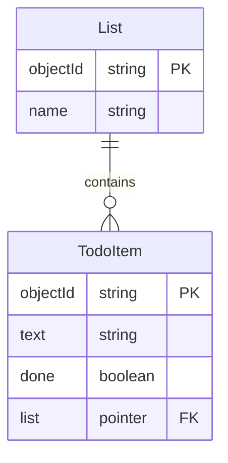

# Relationships Between Object Classes

So far there is one class, and no modeling was required: a to-do has a text and a done flag, and that is the whole design. This note is about what you have to decide the moment there is a second kind of thing in the application — lists that to-dos belong to, users who own them — because how two classes refer to each other is the decision that is hardest to undo once there is data in the database. It assumes you have already written [the four operations against one class](Backends-Low-Code-Backends-and-the-Parse-Platform.md).

You need to think ahead about the database model as soon as there is more than one kind of thing in your application. The main questions are:

1. What are the types of objects in my domain model?
2. What are the relationships between them?

## Todos belong to lists

A single flat pile of to-dos stops being useful somewhere around thirty items. What people actually want is *Personal*, *Apartment*, *Bachelor project* — several lists, each with a name. So:



Note what we did *not* do: we did not add a `list` string field to `TodoItem`. 

### A string would be enough to group them on screen today, and it would be inefficient the moment anyone wants to rename a list.

This is called `normalization` in databases. 

If a concept is expressed in a single place, it's easy to change. In our case, renaming a list: we rename it in a single place. 

### Benefit of a class/table over an attribute is that the class/table can be enriched with more properties later

Our lists could get new properties: priority, etc. Moreover, next week we will want to share a list with other users. If a list is a first class entity in the DB that becomes easily possible. 

### Note: The table name in the DB does not have to match the component in the react app

And note the three names now in play, each in its own layer: `List` is a class in the database, `ToDoList` is the React component that draws one.


## The same idea has three names, depending on the context 

| In a relational database | In Parse                  | In OO lingo |
| ------------------------ | ------------------------- | ----------- |
| table                    | class                     | class       |
| row                      | object                    | object      |
| column                   | field                     | attribute   |
| foreign key              | **pointer**               | a reference |
| join table               | a class with two pointers | —           |

So **a pointer is Parse's foreign key.** It holds which object in which class, and nothing else.

## One-to-many relationships are done with pointers

Set a pointer by handing `set()` the whole object, not its id:

```js
const List = Parse.Object.extend("List");
const TodoItem = Parse.Object.extend("TodoItem");

const item = new TodoItem();
item.set("text", "Call the landlord");
item.set("done", false);
item.set("list", apartmentList);   // ← the object itself, not its id
await item.save();
```

Now we can query all the to-dos in a list:

```js
const query = new Parse.Query(TodoItem);
query.equalTo("list", apartmentList);
const results = await query.find();
```

or get the list a to-do belongs to:

```js
const list = item.get("list");
```

with one catch that will bite you: what comes back from `get("list")` is a Parse object that knows its `id` but has **not** fetched its fields. Asking it for `get("name")` gives you `undefined`. Either fetch it, or — much better — tell the query to bring the lists along:

```js
const query = new Parse.Query(TodoItem);
query.include("list");          // ← fetch the pointed-to objects too
const results = await query.find();
results[0].get("list").get("name");   // now this works
```

One request instead of one-per-to-do. We will have more to say about this in the lecture on efficient communication with the backend.

## Many-to-many relationships are done with a join table

Say a to-do can be tagged with several labels, and a label applies to many to-dos. Create a class whose job is to represent one pairing:

```js
const TodoLabel = Parse.Object.extend("TodoLabel");

const todoLabel = new TodoLabel();
todoLabel.set("todo", todoItem);
todoLabel.set("label", label);
await todoLabel.save();
```

Two pointers, one per side. That is all a join table is.

#### Why a join table rather than anything cleverer?

Because the relationship itself will eventually want to carry information, and only a class can hold information:

```js
todoLabel.set("addedBy", someUser);
todoLabel.set("addedAt", new Date());
todoLabel.set("order", 1);
```

The moment you need *when* the label was added, or *who* added it, or in *what order*, a join table already has room for it and the alternatives do not.

## Note: do not model relationships with `Parse.Relation`

> *You will meet `Parse.Relation` in the documentation*, which is Parse's built-in way of doing many-to-many. It is less typing and it cannot carry any information about the relationship, so we are not going to use it. Knowing that it exists is enough.

## Note: do not model relationships with arrays

Parse lets you store an array of objects in a field, and it is tempting for small collections. Resist it: an array has no room for information about the relationship, it has to be rewritten in full to add one element — the whole-array problem from the beginning of this lecture, all over again — and it gets slow and awkward as soon as it is not tiny. Pointers for one-to-many, a join table for many-to-many. Those two cover everything you need this semester.

## The notation matters less than being able to explain your model

Use whichever notation you prefer. Two that I like are:
1. On the left hand side is the most popular way of showing attributes
	- crow's feet show cardinality
	- attributes are listed in the box
2. On the right hand side is a compressed approach proposed by Søren Lauesen, ex-professor at ITU


No matter which notation you use, the most important aspect is being able to communicate the way all the relevant data for your application domain is saved in the database.

## Exam Questions

### 1. What are the two questions you have to answer about your domain before you create any classes?

### 2. Your app has lists and to-dos. Which class gets the pointer, and why not the other one?

### 3. Why is a join table preferred over an array field for a many-to-many relationship?

### 4. Why model a list as its own class rather than as a string field on each to-do?


## References

The documentation on ParsePlatform.org
- [Relationships](https://docs.parseplatform.org/js/guide/#relations) - this is very good and must be read attentively -- it will really help with modeling
