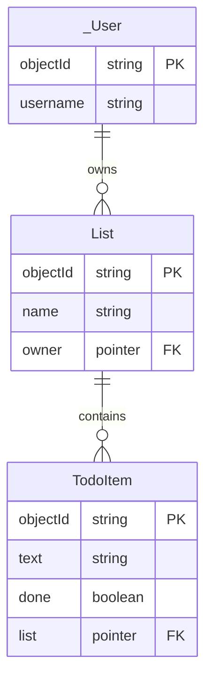

# Relationships Between Object Classes

Until today there was one class, and no modeling was required: a to-do has a text and a done flag, and that is the whole design. This note is about what you have to decide the moment there is a second kind of thing in the application — users who own to-dos, lists that to-dos belong to — because how two classes refer to each other is the decision that is hardest to undo once there is data in the database. It assumes you have already written [the four operations against one class](Backends-Low-Code-Backends-and-the-Parse-Platform.md), and it follows straight on from [Authentication and Authorization](Authorization-and-ACL-in-Parse.md).

You need to think ahead about the database model as soon as there is more than one kind of thing in your application. The main questions are:

1. What are the types of objects in my domain model?
2. What are the relationships between them?

## The first relationship: a to-do has an owner

After the authorization lecture every to-do has an ACL that says Ada may read it. Does that mean the database knows the to-do is *Ada's*?

Not in any way you can use. The ACL is a permission, not a relationship: you cannot write a query that says "the to-dos whose ACL mentions Ada". The ACL only filters, silently, what comes back. If the app wants to *ask* for Ada's to-dos, the to-do needs a field that says whose it is:

```js
item.set("owner", Parse.User.current());
```

and then the query can say it out loud:

```js
const query = new Parse.Query(TodoItem);
query.equalTo("owner", Parse.User.current());
const results = await query.find();
```

Run it in the two-browser setup from last lecture and notice the difference from before: until now Armin saw his own to-dos *plus* the old ones nobody had put an ACL on. Now he sees only the ones that are his, because now he is asking for exactly those.

Remember which of the two is the security, though. The query is something *our* client chooses to send, and nothing obliges anyone else to send it. They do not even need your client: `npm install parse`, twenty lines of Node, and the App ID and JavaScript key they read out of the bundle you shipped them. Then they run whatever query they like, and what stops them is the ACL, on the server ([Authentication and Authorization](Authorization-and-ACL-in-Parse.md)).

That does not make the query a mere convenience. It is also the app's logic: it says what this screen is *for*. "My to-dos" should show Ada's to-dos, and it should keep showing only those even on the day an ACL is set wrong, or once lists start being shared with her. The ACL decides what Ada *may* see; the query decides what she *asked* to see.

## The same idea has three names, depending on the context 

| In a relational database | In Parse                  | In OO lingo |
| ------------------------ | ------------------------- | ----------- |
| table                    | class                     | class       |
| row                      | object                    | object      |
| column                   | field                     | attribute   |
| foreign key              | **pointer**               | a reference |
| join table               | a class with two pointers | —           |

So **a pointer is Parse's foreign key.** It holds which object in which class, and nothing else.

A to-do's `owner` field holds a pointer to a `_User`. A pointer holds **which object in which class**, and nothing else.

## To-dos belong to lists

A single flat pile of to-dos stops being useful somewhere around thirty items. What people actually want is *Personal*, *Apartment*, *Bachelor project* — several lists, each with a name.

Note what we do *not* do: we do not add a `list` string field to `TodoItem`.

### A string would be enough to group them on screen today, and it would be inefficient the moment anyone wants to rename a list.

This is called `normalization` in databases.

If a concept is expressed in a single place, it's easy to change. In our case, renaming a list: we rename it in a single place.

### Benefit of a class/table over an attribute is that the class/table can be enriched with more properties later

Our lists could get new properties: priority, etc. Moreover, you may want to share a list with other users. If a list is a first class entity in the DB that becomes easily possible.

### Create the first list by hand

Before writing any code for lists, open the dashboard, create a `List` class, and add one row by hand: *Apartment*.

The dashboard and your app talk to the same server, so a list created there is exactly as real as one created from code. That is a genuinely useful habit for your project: **not every class needs a create screen in version one.** Seed the things that rarely change by hand, and build screens for what your users actually create. A create screen is worth building when creating that thing is part of the use case you are designing for.

### One-to-many relationships are done with pointers

Set a pointer by handing `set()` the whole object, not its id:

```js
const List = Parse.Object.extend("List");
const TodoItem = Parse.Object.extend("TodoItem");

const item = new TodoItem();
item.set("text", "Call the landlord");
item.set("done", false);
item.set("list", apartmentList);   // ← the object itself, not its id
await item.save();
```

Now we can query all the to-dos in a list:

```js
const query = new Parse.Query(TodoItem);
query.equalTo("list", apartmentList);
const results = await query.find();
```

or get the list a to-do belongs to:

```js
const list = item.get("list");
```

with one catch that will bite you: what comes back from `get("list")` is a Parse object that knows its `id` but has **not** fetched its fields. Asking it for `get("name")` gives you `undefined`. Either fetch it, or — much better — tell the query to bring the lists along:

```js
const query = new Parse.Query(TodoItem);
query.include("list");          // ← fetch the pointed-to objects too
const results = await query.find();
results[0].get("list").get("name");   // now this works
```

Open the network tab and compare: one request instead of one-per-to-do.

### Note: The table name in the DB does not have to match the component in the react app

`List` is a class in the database, `ToDoList` is the React component that draws one. Each name lives in its own layer.

## Refactoring the schema: the owner moves to the list

Now look at the model again. The list belongs to Ada; every to-do in it belongs to Ada. The `owner` on each to-do says the same thing a hundred times. So the owner moves to the list, and the to-do reaches its owner through it:



Then drop the `owner` column from `TodoItem` in the dashboard. It is gone, instantly. Nothing complains, because nothing is enforcing anything: the existing rows simply lose the field. Schema changes are this easy in Parse *precisely because* the database checks nothing — freedom and footgun, same coin.

The ACLs stay where they are, on every object — lists and to-dos alike. **Parse does not pass an ACL down from a list to its to-dos**; if the to-dos should follow their list, your code sets the same ACL on both. That matters the day you share a list: it is the list *and* its to-dos that have to change.

### Creating lists from the app

The cheapest honest version: one text input and a *New list* button at the bottom of the page.

```js
export const createList = async (name) => {
	const currentUser = Parse.User.current();

	const list = new List();
	list.set("name", name);
	list.set("owner", currentUser);
	list.setACL(new Parse.ACL(currentUser));

	return await list.save();
};
```

We have no router yet, so every list renders on the same page, one block per list — and each block gets its **own** new-to-do input. Which list a new to-do belongs to is decided by where the input sits: the list object is already in scope when you render its block, so there is no dropdown and no "selected list" state to keep in sync.

### Loading the page, the simple way

```js
const listQuery = new Parse.Query(List);
listQuery.equalTo("owner", Parse.User.current());
const lists = await listQuery.find();

// and then, inside each list's block:
const todoQuery = new Parse.Query(TodoItem);
todoQuery.equalTo("list", list);
const todos = await todoQuery.find();
```

It works. Now open the network tab and count the requests: **one** for the lists, and then **one more for every list**. Ten lists, eleven round trips. This is called the **N+1 problem**, and we are not fixing it today — only noticing it. It is the same lesson as `include()` above: the shape of the query decides the number of round trips. The fix comes in [Efficient Communication with the Backend](Efficient-Communication-with-the-Backend.md).

The page is also getting crowded. That is the problem routing solves, next week.

## A pointer is a foreign key that nobody checks

In your database course, a foreign key came with a promise: the database will not let it point at a row that does not exist. Parse makes no such promise. Delete a list, and its to-dos are still there, each with a `list` pointer to nothing.

This does not change if your Parse Server runs on Postgres instead of MongoDB: Parse stores the pointer as a plain id, not as a foreign-key constraint. It is the abstraction, not the storage engine, that decides the semantics. And `Parse.Relation`, below, has the same problem.

If you want the guarantee, you write it yourself, on the server, in a trigger that runs whenever a list is deleted — see `beforeDelete` in [Running Code Server-Side](Running-Code-Server-Side.md). The guarantee moves out of the database and into your code.

## Checking the model against the screens: the CRUD matrix

Write your classes down the side and your screens across the top. In each cell, note whether that screen lets the user **C**reate, **R**ead, **U**pdate or **D**elete that class.

| | Main page |
|---|---|
| `TodoItem` | C R U D |
| `List` | C R |

Every class your users own should be fully covered *somewhere*. Here the gap is obvious: a list can be created and shown, but never renamed or deleted.

And the moment you add *delete list*, the previous section comes back: what happens to its to-dos? Decide — delete them too, or refuse to delete a non-empty list — and then enforce it on the server.

Do this for your project model, against your wireframes. It is the cheapest way to find the screen you forgot.

## Further reading: many-to-many, and what not to use

You will need these the day your model has a many-to-many relationship. We do not build one in class.

### Many-to-many relationships are done with a join table

Say a to-do can be tagged with several labels, and a label applies to many to-dos. Create a class whose job is to represent one pairing:

```js
const TodoLabel = Parse.Object.extend("TodoLabel");

const todoLabel = new TodoLabel();
todoLabel.set("todo", todoItem);
todoLabel.set("label", label);
await todoLabel.save();
```

Two pointers, one per side. That is all a join table is.

#### Why a join table rather than anything cleverer?

Because the relationship itself will eventually want to carry information, and only a class can hold information:

```js
todoLabel.set("addedBy", someUser);
todoLabel.set("addedAt", new Date());
todoLabel.set("order", 1);
```

The moment you need *when* the label was added, or *who* added it, or in *what order*, a join table already has room for it and the alternatives do not.

### Note: do not model relationships with `Parse.Relation`

> *You will meet `Parse.Relation` in the documentation*, which is Parse's built-in way of doing many-to-many. It is less typing and it cannot carry any information about the relationship, so we are not going to use it. Knowing that it exists is enough.

### Note: do not model relationships with arrays

Parse lets you store an array of objects in a field, and it is tempting for small collections. Resist it: an array has no room for information about the relationship, it has to be rewritten in full to add one element, and it gets slow and awkward as soon as it is not tiny. Pointers for one-to-many, a join table for many-to-many. Those two cover everything you need this semester.

## The notation matters less than being able to explain your model

Use whichever notation you prefer. Two that I like are:
1. On the left hand side is the most popular way of showing attributes
	- crow's feet show cardinality
	- attributes are listed in the box
2. On the right hand side is a compressed approach proposed by Søren Lauesen, ex-professor at ITU

%%ML: Can we re-render these two with our own domain model? %%


No matter which notation you use, the most important aspect is being able to communicate the way all the relevant data for your application domain is saved in the database.

## Exam Questions

### 1. What are the two questions you have to answer about your domain before you create any classes?

### 2. A to-do already has an ACL that only lets its creator read it. Why does it still need an `owner` pointer?

### 3. This query returns only the current user's to-dos. Explain why it is nevertheless not a security measure, and what is. Why do we still write it?
```js
const query = new Parse.Query(TodoItem);
query.equalTo("owner", Parse.User.current());
const results = await query.find();
```

### 4. Your app has lists and to-dos. Which class gets the pointer, and why not the other one?

### 5. Why model a list as its own class rather than as a string field on each to-do?

### 6. You delete a list. What happens to its to-dos in Parse, and how would it differ in the relational database from your database course? How would you get the guarantee back?

### 7. Your page queries the user's lists, and then the to-dos of each list. How many requests does that make for ten lists, and what is this problem called?

### 8. Why is a join table preferred over an array field for a many-to-many relationship?

## References

The documentation on ParsePlatform.org
- [Relationships](https://docs.parseplatform.org/js/guide/#relations) - this is very good and must be read attentively -- it will really help with modeling
