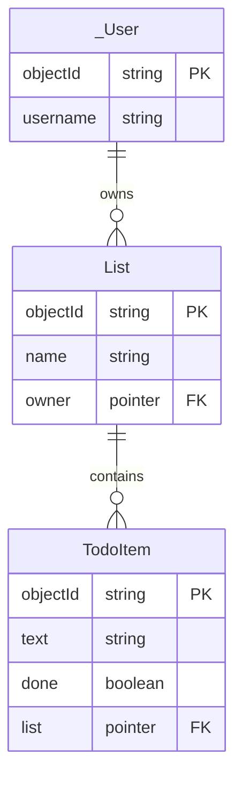
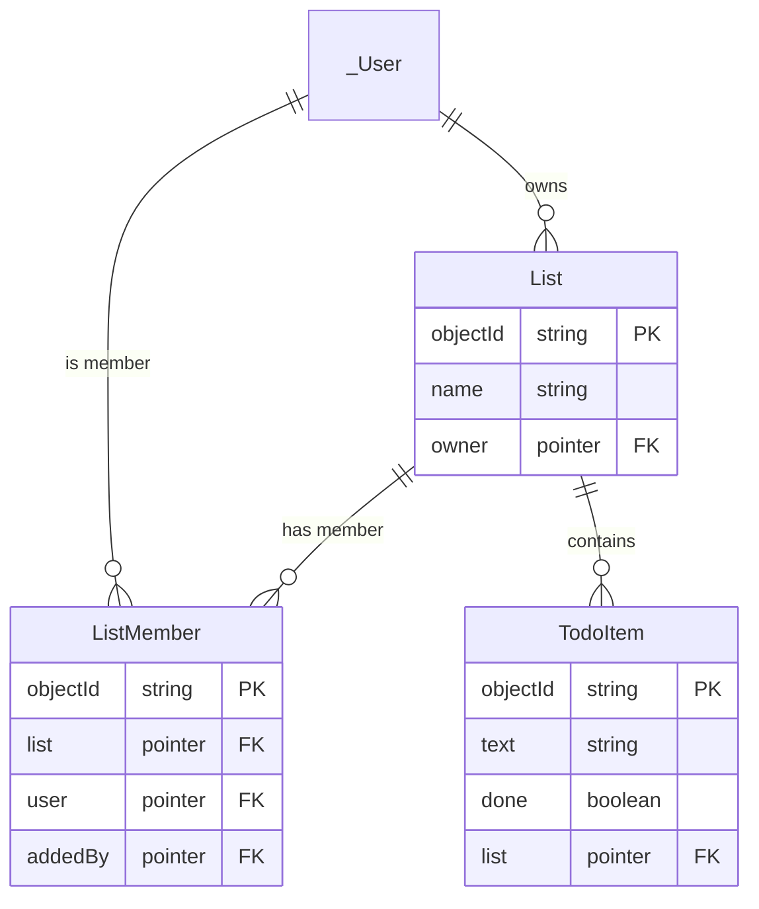

# Relationships Between Object Classes

Until today there was one class, and no modeling was required: a to-do has a text and a done flag, and that is the whole design. This note is about what you have to decide the moment there is a second kind of thing in the application: users who own to-dos, or lists that to-dos belong to. How two classes refer to each other is the decision that is hardest to undo once there is data in the database. It assumes you have already written [the four operations against one class](Backends-Low-Code-Backends-and-the-Parse-Platform.md), and it follows straight on from [Authentication and Authorization](Authorization-and-ACL-in-Parse.md).

You need to think ahead about the database model as soon as there is more than one kind of thing in your application. The main questions are:

1. What are the types of objects in my domain model?
2. What are the relationships between them?

## The first relationship: a to-do has an owner

After the authorization lecture every to-do has an ACL that says Ada may read it. Does that mean the database knows the to-do is *Ada's*?

Not in any way you can use. The ACL is a permission, not a relationship: you cannot write a query that says "the to-dos whose ACL mentions Ada". The ACL only filters, silently, what comes back. If the app wants to *ask* for Ada's to-dos, the to-do needs a field that says whose it is:

```js
item.set("owner", Parse.User.current());
```

and then the query can say it out loud:

```js
const query = new Parse.Query(TodoItem);
query.equalTo("owner", Parse.User.current());
const results = await query.find();
```

Run it in the two-browser setup from last lecture and notice the difference from before: until now Armin saw his own to-dos *plus* the old ones nobody had put an ACL on. Now he sees only the ones that are his, because now he is asking for exactly those.

Remember which of the two is the security, though. The query is something *our* client chooses to send, and nothing obliges anyone else to send it. They do not even need your client: as the `curl` request in [Authentication and Authorization](Authorization-and-ACL-in-Parse.md) showed, the keys you shipped are enough to send any request, any query included. What stops them is the ACL, on the server.

That does not make the query a mere convenience. It is also the app's logic: it says what this screen is *for*. "My to-dos" should show Ada's to-dos, and it should keep showing only those even on the day an ACL is set wrong, or once lists start being shared with her. The ACL decides what Ada *may* see; the query decides what she *asked* to see.

## The same idea has three names, depending on the context 

| In a relational database | In Parse                  | In OO lingo |
| ------------------------ | ------------------------- | ----------- |
| table                    | class                     | class       |
| row                      | object                    | object      |
| column                   | field                     | attribute   |
| foreign key              | **pointer**               | a reference |
| join table               | a class with two pointers | —           |

So **a pointer is Parse's foreign key.** It holds which object in which class, and nothing else.

A to-do's `owner` field holds a pointer to a `_User`, Parse's built-in class for user accounts.

## To-dos belong to lists

A single flat pile of to-dos stops being useful somewhere around thirty items. What people actually want is *Personal*, *Apartment*, *Bachelor project*. Several lists, each with a name.

Note what we do *not* do: we do not add a `list` string field to `TodoItem`.

### A string would be enough to group them on screen today, and it would be inefficient the moment anyone wants to rename a list.

This is called `normalization` in databases.

If a concept is expressed in a single place, it's easy to change. In our case, renaming a list: we rename it in a single place.

### Benefit of a class/table over an attribute is that the class/table can be enriched with more properties later

Our lists could get new properties: priority, etc. Moreover, you may want to share a list with other users. If a list is a first class entity in the DB that becomes easily possible ([Many-to-many: sharing a list](#many-to-many-sharing-a-list), below).

### Create the first list by hand

Before writing any code for lists, open the dashboard, create a `List` class with a `name` column (String) and an `owner` column (Pointer to `_User`), and add one row by hand: *Apartment*, with `owner` set to your own user's `objectId`. Without the owner, the list will not show up once the app loads "my lists" further down.

The dashboard and your app talk to the same server, so a list created there is exactly as real as one created from code. That is a genuinely useful habit for your project: **not every class needs a create screen in version one.** Seed the things that rarely change by hand, and build screens for what your users actually create. A create screen is worth building when creating that thing is part of the use case you are designing for.

### One-to-many relationships are done with pointers

One list has many to-dos; each to-do belongs to exactly one list. That is a **one-to-many** relationship, and the pointer goes on the *many* side: each to-do stores one pointer to its list. The other way round, the list would need an array of to-dos, and the note on arrays at the end says why not. The rule of thumb: **pointers for one-to-many, a join table for many-to-many.**

Set a pointer by handing `set()` the whole object, not its id:

```js
const List = Parse.Object.extend("List");
const TodoItem = Parse.Object.extend("TodoItem");

// the list you created in the dashboard, by its objectId
const apartmentList = await new Parse.Query(List).get("<objectId from the dashboard>");

const item = new TodoItem();
item.set("text", "Call the landlord");
item.set("done", false);
item.set("list", apartmentList);   // ← the object itself, not its id
await item.save();
```

Now we can query all the to-dos in a list:

```js
const query = new Parse.Query(TodoItem);
query.equalTo("list", apartmentList);
const results = await query.find();
```

## Refactoring the schema: the owner moves to the list

Now look at the model again. The list belongs to Ada; every to-do in it belongs to Ada. The `owner` on each to-do says the same thing a hundred times. So the owner moves to the list, and the to-do reaches its owner through it:



Read `||--o{` as "one to many": one user owns many lists, one list contains many to-dos. The notation is explained at the end of this note.

Then drop the `owner` column from `TodoItem` in the dashboard. It is gone, instantly. Nothing complains, because nothing is enforcing anything: the existing rows simply lose the field. Schema changes are this easy in Parse *precisely because* the database checks nothing. Freedom and footgun, same coin.

Two things stop working when the column goes. The "my to-dos" query from the start of this note (`equalTo("owner", …)` on `TodoItem`) now returns nothing: to find Ada's to-dos, the app now finds her lists, and then the to-dos in each (below). And to-dos created before lists existed have no `list` pointer, so no list shows them. Give them one in the dashboard, or delete them.

The ACLs stay where they are, on every list and every to-do. **Parse does not pass an ACL down from a list to its to-dos.** If the to-dos should follow their list, your code sets the same ACL on both. That matters the day you share a list: it is the list *and* its to-dos that have to change. So a new to-do copies the ACL of its list:

```js
export const createTodo = async (text, list) => {
	const item = new TodoItem();
	item.set("text", text);
	item.set("done", false);
	item.set("list", list);
	item.setACL(list.getACL());   // the to-do follows its list
	return toPlainObject(await item.save());
};
```

### Creating lists from the app

The cheapest honest version: one text input and a *New list* button at the bottom of the page.

```js
export const createList = async (name) => {
	const currentUser = Parse.User.current();

	const list = new List();
	list.set("name", name);
	list.set("owner", currentUser);
	list.setACL(new Parse.ACL(currentUser));

	return await list.save();
};
```

We have no router yet, so every list renders on the same page, one block per list. Each block gets its **own** new-to-do input. Which list a new to-do belongs to is decided by where the input sits: the list object is already in scope when you render its block, so there is no dropdown and no "selected list" state to keep in sync.

### Loading the page, the simple way

```js
const listQuery = new Parse.Query(List);
listQuery.equalTo("owner", Parse.User.current());
const lists = await listQuery.find();

// and then, inside each list's block:
const todoQuery = new Parse.Query(TodoItem);
todoQuery.equalTo("list", list);
const todos = await todoQuery.find();
```

It works. The page is also getting crowded. That is the problem routing solves, next week.

## A pointer is a foreign key that nobody checks

In your database course, a foreign key came with a promise: the database will not let it point at a row that does not exist. Parse makes no such promise. Delete a list, and its to-dos are still there, each with a `list` pointer to nothing.

If you want the guarantee, you write it yourself, on the server, in a trigger that runs whenever a list is deleted. See `beforeDelete` in [Running Code Server-Side](Running-Code-Server-Side.md). The guarantee moves out of the database and into your code.


## Many-to-many: sharing a list

Ada wants to share *Apartment* with Armin, who is moving in with her. A list can be shared with many users, and a user can have many lists shared with them. That is a **many-to-many** relationship. Every project in this course has one, because sharing at the list level is part of the required core.

### Sharing with the ACL alone

The simplest version needs no new class. Sharing is [Sharing with another user](Authorization-and-ACL-in-Parse.md#sharing-with-another-user), applied to the list *and* its to-dos, because [Parse does not pass an ACL down](#refactoring-the-schema-the-owner-moves-to-the-list):

```js
export const shareList = async (list, friend) => {
	const acl = list.getACL();
	acl.setReadAccess(friend, true);   // Armin may read, not change
	list.setACL(acl);

	const todos = await new Parse.Query(TodoItem).equalTo("list", list).find();
	todos.forEach((todo) => todo.setACL(acl));

	await Parse.Object.saveAll([list, ...todos]);
};
```

#### Finding the friend: by their exact username

`shareList` needs Armin as a `Parse.User`. The smallest way to get him: one text input where Ada types his username, exactly.

```js
const friend = await new Parse.Query(Parse.User)
	.equalTo("username", name)
	.first();              // undefined if nobody has that username

if (!friend) {
	setError("No user with that name");
	return;
}
await shareList(list, friend);
```

No search, no autocomplete, no list of everybody who has an account. That is less code, and it is also better privacy: Ada can only find someone whose username she already knows. It needs **Find** on `_User` for the **Authenticated** row. The [Auth note](Authorization-and-ACL-in-Parse.md#the-exception-_user) takes Find away from the public, not from logged-in users.

#### Showing it: every list I can see

The page drops the `owner` filter. It asks for every list, and the ACL decides which ones come back: Ada's own, and the ones shared with her. The owner, brought along with `include()`, tells them apart:

```js
const query = new Parse.Query(List);   // no owner filter: the ACL decides
query.include("owner");                // bring the owner object along, not only its id
const lists = await query.find();

// for each list:
const mine = list.get("owner").id === Parse.User.current().id;
// mine ? "Mine" : `Shared by ${list.get("owner").get("username")}`
```

This is a legitimate design, and for many apps it is enough. Know what it costs, though. The query no longer says what the screen is for, so **every ACL mistake is now on screen**. Take a list created in the dashboard without an ACL. It is publicly readable, so it shows up for every user of your app, as "shared by" whoever owns it.

### When the relationship needs to become a class: Armin wants to leave

Armin is done with the apartment, and wants *Apartment* off his screen. He cannot do it. The fact "Armin may read this list" lives inside the list's ACL. The list is Ada's, and Armin only has read access to it. Only Ada can take him off.

That is the sign. **When someone other than the owner needs to change a relationship, the relationship needs a row of its own.** That someone can then be given the right to change the row. The same goes for anything you need to *store* about the relationship: an invitation Armin has to accept first, who added him, whether he may edit.

### A join table: `ListMember`

Create a class whose job is to represent one membership: one row says *this user is on this list*.



Two pointers, one per side. That is all a join table is: two one-to-many relationships, meeting in the middle. Sharing now also writes a membership. It has an ACL of its own, which lets **both** of them change it:

```js
const ListMember = Parse.Object.extend("ListMember");

const member = new ListMember();
member.set("list", list);
member.set("user", friend);
member.set("addedBy", Parse.User.current());
const memberAcl = new Parse.ACL(Parse.User.current());   // Ada
memberAcl.setReadAccess(friend, true);                   // and Armin
memberAcl.setWriteAccess(friend, true);
member.setACL(memberAcl);
await member.save();
```

Armin's shared lists and Ada's members are now ordinary queries. And leaving is one line, which Armin is allowed to run:

```js
// Armin: the lists shared with me
const shared = new Parse.Query(ListMember);
shared.equalTo("user", Parse.User.current());
shared.include("list");
const memberships = await shared.find();

// Ada: who is on this list?
const members = new Parse.Query(ListMember);
members.equalTo("list", apartmentList);
members.include("user");
const people = await members.find();

// Armin leaves
await membership.destroy();
```

The same shape fits any many-to-many: labels on to-dos would be a `TodoLabel` class, with a `todo` and a `label` pointer.


### Leaving is recorded in the data; access is still decided by the ACL

Armin has destroyed his membership, and the list is off his screen. But the ACLs on the list and its to-dos still name him, and the server still lets him read them. `ListMember` is data; it opens and closes nothing.

So the same fact now lives in two places: `ListMember` says who is on the list, the ACLs say who may read it. That is the redundancy argument from [the refactoring above](#refactoring-the-schema-the-owner-moves-to-the-list). This time it cannot be removed, because one copy is the data and the other is the security. Sharing has the same problem the other way round. `saveAll` sends the membership and the ACLs in one request, but not as a transaction. If it fails halfway, they disagree.

Keeping the two in step needs code with authority over Ada's objects, even when Armin is the one acting. That is the server. An `afterDelete` on `ListMember` that takes Armin out of the ACLs is exactly what [Running Code Server-Side](Running-Code-Server-Side.md) is for. Until then, the client does its best, and you know where the gap is.

### Is `owner` still needed?

Once `ListMember` exists, Ada could be a member of her own list too, and the `owner` pointer would go. Or `owner` stays, because *the one who may delete the list and share it* is a different thing from *a member who reads it*. Both are defensible; which one is right depends on what your users do. It is exactly the kind of decision the data-model page of your report asks you to explain.

### Where sharing grows from here, and why to keep it small

Everything past this point gets expensive quickly: a list of members, removing one, co-owners, members who may invite others, handing a list over, groups of people you share with again and again. 

Each of them is mostly **interface work**: screens to find, add, show and remove people. And each of them has to keep the memberships and every ACL in step. The tools exist: [roles](Authorization-and-ACL-in-Parse.md#advanced-roles-for-groups-of-users-you-reuse) put one group in an ACL instead of every person, and server code keeps the copies agreeing. But none of it is in the required core.

> Sharing is the most expensive feature in your app, and almost all of the cost is the interface. Build the smallest version your user study supports: share by username, and show who shared it. Treat everything beyond that as an optional feature you pick and defend.

## The notation matters less than being able to explain your model

Use whichever notation you prefer. Two that I like are:
1. On the left hand side is the most popular way of showing attributes
	- crow's feet show cardinality
	- attributes are listed in the box
2. On the right hand side is a compressed approach proposed by Søren Lauesen, ex-professor at ITU

<!-- ML: Can we re-render these two with our own domain model? -->


No matter which notation you use, the most important aspect is being able to communicate the way all the relevant data for your application domain is saved in the database.

## Checking the model against the screens: the CRUD matrix

Write your classes down the side and your screens across the top. In each cell, note whether that screen lets the user **C**reate, **R**ead, **U**pdate or **D**elete that class.

| | Main page |
|---|---|
| `TodoItem` | C R U D |
| `List` | C R |

Every class your users own should be fully covered *somewhere*. Here the gap is obvious: a list can be created and shown, but never renamed or deleted.

And the moment you add *delete list*, the previous section comes back: what happens to its to-dos? Decide: delete them too, or refuse to delete a non-empty list. Then enforce it on the server.

Do this for your project model, against your wireframes. It is the cheapest way to find the screen you forgot.


## Restrictions about Parse

### Do not model relationships with `Parse.Relation`

*You will meet `Parse.Relation` in the documentation*, which is Parse's built-in way of doing many-to-many. It is less typing, and it cannot carry any information about the relationship, or have an ACL of its own that lets Armin leave. So we are not going to use it. Knowing that it exists is enough.

### Do not model relationships with arrays

Parse lets you store an array of objects in a field, so a `members` array on the list is tempting. Resist it. An array has no room for information about the relationship. It lives inside the list, so only the list's owner can change it. It has to be rewritten in full to add one element. And it gets slow and awkward as soon as it is not tiny. Pointers for one-to-many, a join table for many-to-many. Those two cover everything you need this semester.


## Exam Questions

### 1. What are the two questions you have to answer about your domain before you create any classes?

### 2. A to-do already has an ACL that only lets its creator read it. Why does it still need an `owner` pointer?

### 3. At the start of this note, this query returned only the current user's to-dos. Explain why it was nevertheless not a security measure, and what is. Why do we still write it?
```js
const query = new Parse.Query(TodoItem);
query.equalTo("owner", Parse.User.current());
const results = await query.find();
```

### 4. Your app has lists and to-dos. Which class gets the pointer, and why not the other one?

### 5. Why model a list as its own class rather than as a string field on each to-do?

### 6. You delete a list. What happens to its to-dos in Parse, and how would it differ in the relational database from your database course? How would you get the guarantee back?

### 7. Why is a join table preferred over an array field or a `Parse.Relation` for list membership?

### 8. Ada shared a list with Armin through its ACL. Armin wants to leave it. Why can he not, what does a `ListMember` class change, and what does it still not change?

### 9. Once `ListMember` exists, do you still need an `owner` pointer on `List`? Argue for one answer.

## References

The documentation on ParsePlatform.org
- [Relationships](https://docs.parseplatform.org/js/guide/#relations) - this is very good and must be read attentively -- it will really help with modeling
