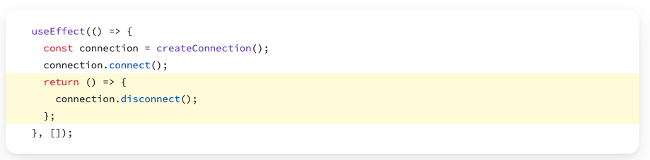

# `useEffect` Against a Live Backend

Keeping local storage in step with state needed nothing but a dependency list. A backend is different in two ways: a live query is a resource that has to be released, and a careless effect now costs money rather than milliseconds.

## Releasing Resources on Component Unmount

### This is ugly and won't be necessary often. But it pushes your understanding of JS syntax... 

It's something that you'll need to do also in other components.

### Sometimes a component allocates a resource in the initialization and that resource has to be de-allocated in the component *destruction*. 

Examples of such resources could be:
- a reference to a timer - that executes an action every second
- a connection to a database

### If your effect allocates a resource that must be deallocated, do that by returning a *cleanup function* from useEffect

#### The syntax is ***UGLY***: **an arrow function that does the connection, and then returns another function that does the disconnect** 



#### And  example of resource that needs to be released: a timer

```javascript
useEffect(() => {
  setInterval(() => {console.log("hello")},1000)
}, [])
```

The correct way of handling it:
```javascript
useEffect(() => {

  let interval = setInterval(() => {console.log("hello")}, 1000)

  return () => {
    clearInterval(interval) // clear the interval in the returning function
  }
  
}, [])
```

# Second special case of `useEffect`: no second argument at all!

A very special case of calling `useEffect` is with no second argument:
```javascript
function MyComponent() {  

	useEffect(() => {  
		console.log("every render!")
	});  
	
	return <div />;  
}
```

## **Every time the component renders, React updates the screen and then runs the code inside useEffect.** 

## This is not normally used, except for debugging in my experience. 

## This is the fastest way to run out of cloud credits when you'll connect to the DB later in the course


## Exam Questions

### 1. When would you use a cleanup function in useEffect?

### 2. What's wrong with this useEffect for polling?
```js
useEffect(() => {
  const interval = setInterval(() => {
    fetchMessages();
  }, 5000);
}, []);
```
Hint: resource cleanup.
