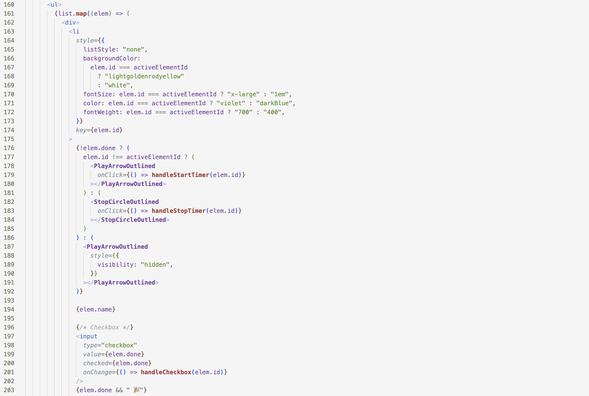
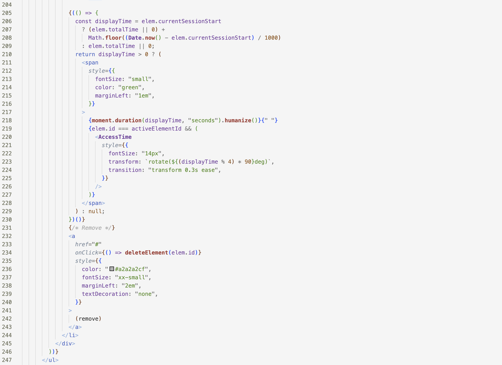
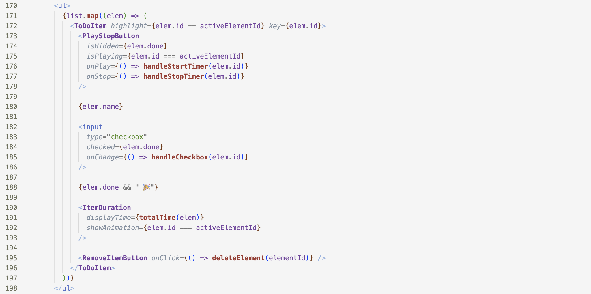

# Refactoring by Extracting Components

**Lesson:** refactoring is critical for having a codebase that is maintainable and pleasant to work with

### Challenge: Compare the following equivalent versions of code

- They have **exactly the same behavior**: rendering items in the todo list
- Which of them is easier to read? 

#### Version 1

#### Version 2 

- this version allows us to think in terms of the UI elements that are all at the same abstraction level - the play/stop button, the name of the todo list item, its duration, the remove button.
- the previous version was at all possible abstraction levels
	- play button 
	- maths computation
	- css details
	- etc. 

### Principle: Code in a component should be at the same abstraction level

### Advice: iterate. iterate. iterate
- there is no way to arrive to simple code without a lot of iteration

### Advice 2: first make it work. then refactor it and make it nice
- you never get it right from the first time

# Where the State Goes

Extraction has a consequence. Split one component into three and some of them will need
to agree about the same piece of state — which now belongs to none of them. The two
patterns from [Component Communication](Patterns-of-Component-Communication.md)
(props down, callbacks up) are not enough on their own.

## sibling to sibling by "*lifting the state*"

Sometimes, you want the state of two components to always change together. 

To do it, you _lift the state up_:
- remove state from both of them
- move it to their closest common parent, and then 
- pass it down to them via props

This is a common thing you will do when writing React

**Example**: in the TODO list application, ensuring that one can't start two tasks in two different lists

## Sending a message from one component to the other

- also has to be done via the parent
- in our case, imagine that you want to move one of the tasks, from one list to the other
- the parent would have to know about all the lists and a given list will have to call a callback on the parent to decide to which list does one 

**To read for next time**: [Sharing state between components](https://react.dev/learn/sharing-state-between-components)
- talks about lifting state with an example

## Exam Questions

### 1. What does "lifting state up" mean in React?

### 2. Why is this principle important: *"Code in a component should be at the same abstraction level"*?

# The same function, written twice

Components are not the only thing worth extracting. A pattern from previous cohorts, seen
often enough to be worth naming: `const getCurrentUser = async () => …` defined once in
`ProfileBar` and again in `Settings`, because both screens needed it and neither knew
about the other.

Two copies of a function are two things to fix when the backend changes, and they drift
silently — one gets a null check, the other does not. Pull it into a **custom hook**
(`useCurrentUser`) and both screens call the same code.

The signal to watch for: you are about to write something you have a feeling you already
wrote. You probably did.
