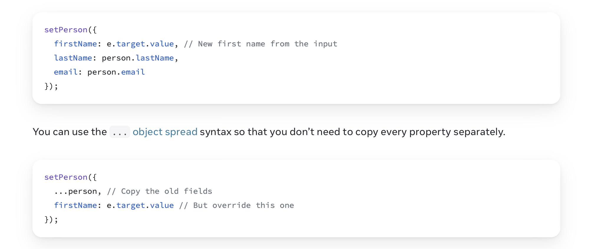
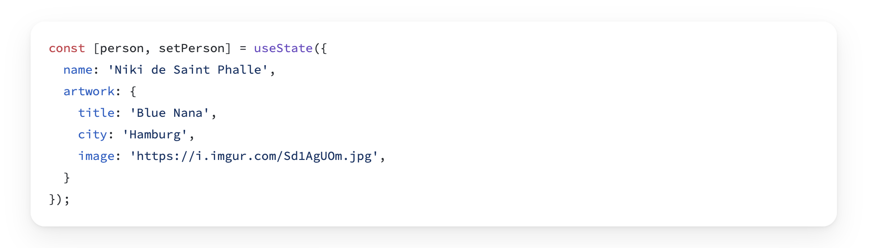
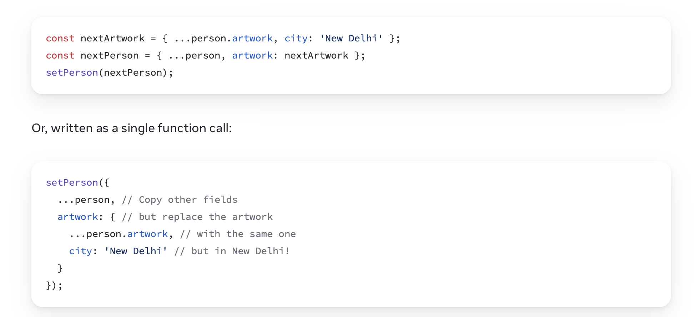

# Javascript the Language

## Trying any of this out

Everything below is plain JavaScript, so you do not need a browser, a page, or React to run it. If you have Node installed — you will need it for the course anyway — typing `node` in a terminal drops you into a REPL:

```
$ node
Welcome to Node.js v22.
> const todos = ["Buy milk", "Call the landlord"];
undefined
> todos.length
2
> todos.map(t => t.toUpperCase())
[ 'BUY MILK', 'CALL THE LANDLORD' ]
```

It evaluates a line at a time and prints the result, so it is the fastest way to check what something actually does rather than what you assume it does. `.editor` lets you paste several lines at once, `.exit` or Ctrl-D leaves.

For a whole file, `node whatever.js` runs it. And the browser's DevTools console is the same thing in the other place you will be working — the language is identical, only the surroundings differ.

**Try the examples as you read.** Half of them are about the difference between changing a thing and making a new one, and that is much easier to believe when you have watched it in front of you.


(source: [StackOverflow developer survey](https://survey.stackoverflow.co/2023/#programming-scripting-and-markup-languages))

## Why the popularity? 

**Versatility**. With JS, as of 2023, you can building quite a few things besides interactive web apps:
- web servers (Node.js),
- browser extensions,
- services, desktop apps (electron),
- games (WebGL), IoT etc.

**Portability**. Available on every device with a browser or a node.exe.

**Speed**. It's fast.

Variant: TypeScript.

## The Language 

Look at the following code, from a [tutorial](https://replicate.com/blog/how-to-prompt-llama) on how to use Large Language Models. Do you understand it? It illustrates a few of the main features of JS points of today's discussion:

```javascript

const messageHistory = [...messages];

messageHistory.push({
  text: userMessage,
  isUser: true,
});

const generatePrompt = (history) => {
      return messages
        .map((history) =>
          message.isUser
            ? `[INST] ${message.text} [/INST]`
            : `${message.text}`
        )
        .join("\n");
    };
```
(Context of the [code](https://github.com/replicate/llama-chat/blob/main/app/page.js#L73))

## Language Basics

- Read the [Language Basics](https://developer.mozilla.org/en-US/docs/Web/JavaScript/Guide/Grammar_and_types#basics) article and make sure that yo u can answer the following questions:
	- **Basics**
		- Is JS case sensitive? Can you use unicode in identifier names? What about string values?
	- **Declarations**
		- What's a global and what's a local variable? ([see](https://developer.mozilla.org/en-US/docs/Web/JavaScript/Guide/Grammar_and_types#variable_scope))
		- **What is the difference between `var`, `let`, and `const`? ([see](https://developer.mozilla.org/en-US/docs/Web/JavaScript/Guide/Grammar_and_types#declarations) [also](https://developer.mozilla.org/en-US/docs/Web/JavaScript/Reference/Statements/block))**
		- What is block scope? What other scopes are there?
		- How do you define a variable global to a file?
		- How do you define a variable that is only visible within a function scope?
	- **Data Types**
		- What are the seven data types in JS? ([see](https://developer.mozilla.org/en-US/docs/Web/JavaScript/Guide/Grammar_and_types#data_types))
		- What does it mean that JS is dynamically typed? ([see](https://developer.mozilla.org/en-US/docs/Web/JavaScript/Guide/Grammar_and_types#data_type_conversion))
		- What happens when you use the `+` operator on a number and a string? What about the `*` operator ? ([see](https://developer.mozilla.org/en-US/docs/Web/JavaScript/Guide/Grammar_and_types#numbers_and_the_operator))
		- [How do you convert a string to a number](https://developer.mozilla.org/en-US/docs/Web/JavaScript/Guide/Grammar_and_types#converting_strings_to_numbers)?
		- Object literals? What is an object in JS?
	- **Literals**
		- How to define an Array literal? ([see](https://developer.mozilla.org/en-US/docs/Web/JavaScript/Guide/Grammar_and_types#array_literals))
		- How to define an Object literal? ([see](https://developer.mozilla.org/en-US/docs/Web/JavaScript/Guide/Grammar_and_types#array_literals))
		- What are *template literals* and when do you use them? ([see](https://developer.mozilla.org/en-US/docs/Web/JavaScript/Guide/Grammar_and_types#string_literals))

## Loops and Iterations
- [for statement](https://developer.mozilla.org/en-US/docs/Web/JavaScript/Reference/Statements/for)
- [while](https://developer.mozilla.org/en-US/docs/Web/JavaScript/Reference/Statements/while)
- [for...in...](https://developer.mozilla.org/en-US/docs/Web/JavaScript/Reference/Statements/for...int)
	- does this iterate over the keys or the values of an object?
	- why is this not appropriate for arrays?
	- what is the right way to iterate over an array?
- [for ... of ...](https://developer.mozilla.org/en-US/docs/Web/JavaScript/Reference/Statements/for...of)
	- does this iterate over the keys of an object or the values of an iterable?
	- how do you iterate over the values in a Map?
- [discussion](https://stackoverflow.com/a/29286412/1200070) on SO on the difference between `for ... in` and `for ... of`

## Expressions and Operators
- [Comparison Operators](https://developer.mozilla.org/en-US/docs/Web/JavaScript/Guide/Expressions_and_operators#comparison_operators) - must read
	- Why is there a need for a strict equality ([`===`](https://developer.mozilla.org/en-US/docs/Web/JavaScript/Reference/Operators/Strict_equality)) and a strict inequality operator ([`!==`](https://developer.mozilla.org/en-US/docs/Web/JavaScript/Reference/Operators/Strict_inequality))?
- [Logical Operators](https://developer.mozilla.org/en-US/docs/Web/JavaScript/Guide/Expressions_and_operators#logical_operators)
- [Ternary Operator](https://developer.mozilla.org/en-US/docs/Web/JavaScript/Guide/Expressions_and_operators#conditional_ternary_operator)


## Functions

To know:
* How to declare a function? ([see](https://developer.mozilla.org/en-US/docs/Web/JavaScript/Guide/Functions))
* How to declare a function expression? ([see](https://developer.mozilla.org/en-US/docs/Web/JavaScript/Guide/Functions#function_expressions))
* What is the difference between a named function expression and an unnamed function expression?
* Can variables inside of a function be accessed outside of it? What about those outside of the function, can they be accessed inside it? ([see](https://developer.mozilla.org/en-US/docs/Web/JavaScript/Guide/Functions#function_scope))
- What is an arrow function? ([Arrow Function Expressions](https://developer.mozilla.org/en-US/docs/Web/JavaScript/Reference/Functions/Arrow_functions))

## Arrays
- [map](https://developer.mozilla.org/en-US/docs/Web/JavaScript/Reference/Global_Objects/Array/map)
- [filter](https://developer.mozilla.org/en-US/docs/Web/JavaScript/Reference/Global_Objects/Array/filter)
- Mutable treatment of arrays (changing an existing object)
  - [push](https://developer.mozilla.org/en-US/docs/Web/JavaScript/Reference/Global_Objects/Array/push) - adding at the end
  - [pop](https://developer.mozilla.org/en-US/docs/Web/JavaScript/Reference/Global_Objects/Array/pop) - removes from the end
  - [splice](https://developer.mozilla.org/en-US/docs/Web/JavaScript/Reference/Global_Objects/Array/splice) - changes contents starting with given index
-


## Immutable treatment of arrays (creating a new object)

### Making a copy of an array

```js
let words = ['selfogelig', 'krokodil'];

// This will be a copy of the array
let newArray = words.map (each => each);

// Another way of making a copy is the spread operator 
let yetAnotherArray = [...words];

```

[Spread Syntax](https://developer.mozilla.org/en-US/docs/Web/JavaScript/Reference/Operators/Spread_syntax) , e.g.`[...artists]`


### Adding an element to an array with the spread operator: 

```js

let threeWords = [...words, "kroper"];

let artists = [{id:"leo", name: "Leonardo"}];

let moreArtists = [...artists, {id:"michi", name: "Michelangelo"}]
```

### Removing an element from an array

```js
let fewerArtists = moreArtists.filter(a => a.id !== "leo")
```
`
### Modifying an element in an array

#### Replacing a constant inside of an array

```js
let words = ['selfogelig', 'krokodil'];

// This will be a copy of the array
let newArray = words.map (each => each);

// Another way of making a copy is the ... spread operator 
let yetAnotherArray = [...words];

```


#### Modifying an Object inside an array
```js
let superheroes = [ {name: "spiderman", power: "climbing"}, {name: "superman", power: "flying"}]; 

superheroes.map (each => each.name == "superman"? {...each, power:"strength and flight" }: each)
```
  `
	


## Immutable treatment of objects

### Modifying objects is easiest with the spread syntax



### Updating nested objects is ... a little bit ugly


## Inserting in the middle

### Inserting an element  can be done with two uses of `slice`: 

```javascript
  function handleClick() {
    const insertAt = 1; // Could be any index
    const nextArtists = 
	[
      
      // Items before the insertion point:
      ...artists.slice(0, insertAt),
      
      // New item:
      { id: nextId++, name: name },
      
      // Items after the insertion point:
      ...artists.slice(insertAt)
    ];
    setArtists(nextArtists);
    setName('');
  }

```

## The methods that change the array under you

### Sorting, reversing - `reverse`, `sort` -- they mutate the array. 

- But it's ok if you copy the array first, and then mutate it the way you like

```
let reversedArtists = [...artists].reverse();
```

## Why any of this matters

Nothing above is a rule of JavaScript — `push`, `sort` and `splice` are perfectly good functions and there is nothing wrong with using them. It matters because of what you will build on top of the language.

React decides whether to redraw by asking *is this the same object I had before?* — not by looking inside it. Hand it back the same array with one more item pushed onto it and the answer is yes, it is the same object, so nothing happens on screen even though the data changed. Hand it a new array and the answer is no, and it redraws.

So in a React app you reach for the versions that **return something new** — `map`, `filter`, spread — and avoid the ones that change what they were given.
